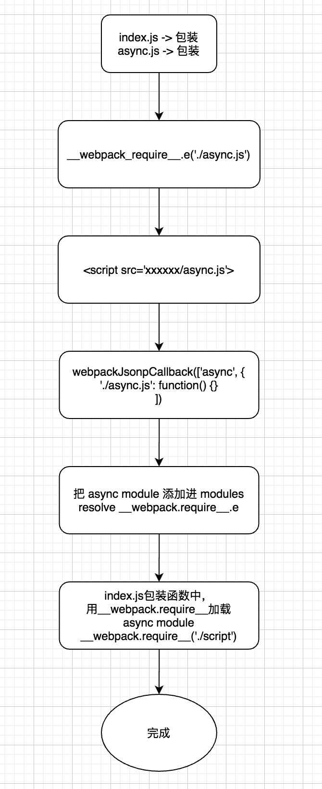

# 2020

## 一月

### 运行时设置 webpack 的 publicPath

`publicPath` 是 webpack 提供的配置公共路径的地方，可以通过它来指定应用程序中所有资源的基础路径，如果我们想要运行时设置`publicPath`，可以通过动态设置`__webpack_public_path__`来实现

在`app.js`中：

```js
__webpack_public_path__ = '/public/';

// 打包后对应的变量名
__webpack_require__.p = '/public/';
```

在打包后，会有一个`__webpack_require__.p`变量来保存最新设置的值

## 二月

### 大文件上传切片方法

前端上传打文件的时候，一般都会用切片上传的方式，核心主要是用`Blob.prototype.slice`进行切片，这个方法可以返回一个新的切片`Blob`对象，前端处理这么写：

```js
function createFileChunk(file, size = 1 * 1024 * 1024) {
  const fileChunkList = [];
  let cur = 0;
  while (cur < file.size) {
    fileChunkList.push({
      // 利用 Blob.prototype.slice 切片
      file: file.slice(cur, cur + size),
    });
    cur += size;
  }
  return fileChunkList;
}
```

### JavaScript 判断整型的方法

es5：

```js
function isInteger(x) {
  return parseInt(x, 10) === x;
}
```

es6：

```js
function isInteger(x) {
  return Number.isInteger(x);
}
```

### 如何在 html 上实现重定向？

使用`meta content url`方法，`http-equiv="refresh"`定义文档自动刷新的时间间隔(多少秒)，设置在`content`里`url`的前面

```html
<!DOCTYPE html>
<html>
  <head>
    <meta http-equiv="refresh" content="0;url=xxx" />
  </head>
  <body></body>
</html>
```

## 三月

### docker nginx 容器如何访问宿主机

在用 docker nginx 进行反向代理本地一些服务的时候，默认用 localhost 是直接访问容器的本身，所以要在 nginx 的 conf 文件中配置指定的 ip 地址，但是网络切换的话，ip 会变，所以只能修改配置文件进行重启这个容器，其实不方便，那么有什么办法可以省去这步骤呢？

- 在 mac desktop 环境中，可以用`host.docker.internal`来获取到宿主机的 ip 地址
- 在 linux 环境中，可以`--network host`模式启动容器

在 mac 环境中，nginx 的 conf 文件中可以这么写了：

```
location / {
  proxy_pass http://host.docker.internal:5505/;
}
```

### vscode vue 文件中无法识别"@/xxx"文件路径

使用 `jsconfig.json` 解决

```json
{
  "compilerOptions": {
    "baseUrl": ".",
    "paths": {
      "@/*": ["./src/*"],
      "g6/*": ["./src/g6/*"]
    },
    "target": "ES6",
    "module": "commonjs",
    "allowSyntheticDefaultImports": true
  },
  "include": ["src/**/*"],
  "exclude": ["node_modules"]
}
```

### 使用对象填充数组

```js
const length = 3;
const resultA = Array.from({ length }, () => ({}));
const resultB = Array(length).fill({});

resultA; // => [{}, {}, {}]
resultB; // => [{}, {}, {}]

resultA[0] === resultA[1]; // => false
resultB[0] === resultB[1]; // => true
```

由此可见，用`Array.from`比`fill`方法更好，可以避免由于相同对象引起的一些麻烦。

## 四月

### 如何设计一个同时支持具名插槽和默认插槽的 vue 组件

如果想要开发一个同时支持具体插槽和默认插槽的 vue 组件，关键在于如何判断组件是否使用了默认插槽，也就是加个判断：

```js
computed: {
  hasSlotDefault() {
    // 组件内如果没内容，$slots.default 为 undefined
    return !!this.$slots.default;
  }
},
```

模板写法：

```html
<div class="project-main">
  <template v-if="!hasSlotDefault">
    <div class="menu">
      <slot name="menu"></slot>
    </div>
    <div class="module">
      <slot name="module"></slot>
    </div>
  </template>
  <template v-else>
    <slot></slot>
  </template>
</div>
```

### 如何在 .eslintrc.js 中配置 prettier 规则

```js
rules: {
  'prettier/prettier': ['error', { singleQuote: true }]
}
```

### 使用 emoji 设置 网页的 favicon 的方法

```js
const setFavicon = function(url) {
  const favicon = document.querySelector('link[rel="icon"]');
  if (favicon) {
    favicon.href = url;
  } else {
    const link = document.createElement('link');
    link.rel = 'icon';
    link.href = url;

    document.head.appendChild(link);
  }
};

const emojiFavicon = function(emoji) {
  const canvas = document.createElement('canvas');
  canvas.height = 64;
  canvas.width = 64;

  const context = canvas.getContext('2d');
  context.font = '64px serif';
  context.fillText(emoji, 0, 64);

  const url = canvas.toDataURL();

  setFavicon(url);
};

// Usage
emojiFavicon('🎉');
```

### 计算 scrollbar 宽度的方法

```js
const calculateScrollbarWidth = function() {
  const outer = document.createElement('div');
  outer.style.visibility = 'hidden';
  outer.style.overflow = 'scroll';

  document.body.appendChild(outer);

  const inner = document.createElement('div');
  outer.appendChild(inner);

  // 里外宽度相减得出滚动条的宽度
  const scrollbarWidth = outer.offsetWidth - inner.offsetWidth;

  document.body.removeChild(outer);

  return scrollbarWidth;
};
```

### pipe-promise

跟 compose 函数用法类似，只不过 compose 函数是从右到左执行，链式，按顺序调用 promise 函数

```js
const pipe = (...functions) => (input) =>
  functions.reduce((chain, func) => chain.then(func), Promise.resolve(input));
```

## 五月

### iview Modal 组件 slot 重渲染

iview Modal 组件关闭后再打开内部插槽组件是不会重新渲染的，如果要重渲染，如何实现？下面是二次封装 Modal 组件解决方式的一些代码片段：

```vue
<template>
  <Modal v-model="show" v-bind="$attrs" v-on="$listeners">
    <template v-if="slotRerender">
      <slot v-if="showSlot"></slot>
    </template>
    <template v-else>
      <slot></slot>
    </template>
  </Modal>
</template>

<script>
export default {
  watch: {
    async value(n) {
      if (n === true) {
        this.showSlot = !n;
        await this.$nextTick();
        this.show = n;
        this.showSlot = n;
      } else {
        this.show = n;
      }
    },
  },
};
</script>
```

### 如何用 this.\\\$xxx 方式挂载 vue 组件

比如我这边有个基于 iview modal 封装的弹窗组件 ErsConfirm，用普通的模板写法就是这样的

```html
<ErsConfirm
  v-model="modal1"
  title="删除"
  confirm-info="确定要删除该项目吗？"
  @on-confirm="ok"
  @on-close="cancel"
/>
```

如果在业务逻辑中存在多个询问弹窗层，写大量模板是比较难受的事情，代码也比较冗余，所以需要用 js 命令式的方式进行组件挂载，这样看起来就优雅得多，下面是实现过程：

```js
import Vue from 'vue';
import ErsConfirm from './ErsConfirm/ErsConfirm.vue';

// Vue.use()
export default function(Vue) {
  Vue.prototype.$ErsConfirm = createErsConfirm;
}

function createErsConfirm(options = {}) {
  const instance = ErsConfirm.newInstance(options);
  instance.show();
}

// 拿属性，不拿方法
function getAttrs(props) {
  return Object.keys(props).reduce((pre, cur) => {
    if (typeof props[cur] !== 'function') {
      pre[cur] = props[cur];
    }
    return pre;
  }, {});
}

function noop() {}

ErsConfirm.newInstance = (props) => {
  const { onConfirm, onClose } = props;
  const attrs = getAttrs(props);
  const instance = new Vue({
    inheritAttrs: false,
    data: {
      visible: false,
    },
    methods: {
      change(value) {
        if (value === false) {
          this.remove();
        }
      },
      remove() {
        setTimeout(() => {
          this.destroy();
        }, 300);
      },
      destroy() {
        this.$destroy();
        if (this.$el) {
          document.body.removeChild(this.$el);
          this.$el = null;
        }
      },
    },
    render() {
      return (
        <ErsConfirm
          value={this.visible}
          on-input={this.change}
          {...{
            attrs,
            on: {
              'on-confirm': onConfirm || noop,
              'on-close': onClose || noop,
            },
          }}
        />
      );
    },
  });

  const component = instance.$mount();
  document.body.appendChild(component.$el);

  return {
    show() {
      instance.visible = true;
    },
  };
};
```

安装插件

```js
import $ErsConfirm from './$ErsConfirm';
Vue.use($ErsConfirm);
```

这样，就可以用 this.\\\$ErsConfirm 方式来使用了该组件了

```js
this.$ErsConfirm({
  title: '删除',
  confirmInfo: '确定要删除该项目吗？',
  onConfirm: () => {
    console.log('confirm');
  },
  onClose: () => {
    console.log('close');
  },
});
```

## 六月

### typeScript 中的元组

元组即 h 为合并了多种类型的数组，用于定义具有有限数量的未命名属性的类型

比如这么使用：

```typeScript
const tuple: [number, string, boolean] = [0, '1', true];
```

预先声明了什么类型，都需要提供对应的值

### yarn link 出现 permission denied

在本地`mac`开发环境中，`yarn link`之后如果可能会遇到`permission denied`问题，可参考这个[issue](https://github.com/yarnpkg/yarn/issues/3587)

解决方法就是需要使用`chmod +x`+你的`bin`文件中的`index.js`开启可执行权限，例如你的文件在`xxx/cli/bin/index.js`中，则使用`chmod +x xxx/cli/bin/index.js`就可以了

### Object.is polyfill

```js
if (!Object.is) {
  Object.is = function(x, y) {
    // SameValue algorithm
    if (x === y) {
      // Steps 1-5, 7-10
      // Steps 6.b-6.e: +0 != -0
      return x !== 0 || 1 / x === 1 / y;
    } else {
      // Step 6.a: NaN == NaN
      return x !== x && y !== y;
    }
  };
}
```

### yarn link 之后可执行命令存在哪里

存在了`/usr/local/bin`目录下

## 七月

### 转译函数

```js
// Security helper :)
function EscapeHtml() {
  const map = {
    '&': '&amp;',
    '<': '&lt;',
    '>': '&gt;',
    '"': '&quot;',
    "'": '&#039;',
  };
  return text.replace(/[&<>"']/g, (m) => {
    return map[m];
  });
}
```

### nodejs 一些路径变量

最近在写脚手架，记录些路径变量

```js
console.log(__dirname); // 当前文件执行路径
console.log(process.cwd()); // 当前程序运行路径，也就是在哪开始 node xxx 的

// path.resolve() 方法可以将多个路径解析为一个规范化的绝对路径
// path.join() 方法可以连接任意多个路径字符串
// 注意，path这些api并不会使用文件系统来判断该路径合不合法，只是单纯的处理'./'和'/'
```

### 模块重定向

如果我们想要在当前模块中，导出指定导入模块的默认导出（等于是创建了一个“重定向”）：

```js
import A from "./A.vue';
export default A;

// 其实是可以用模块重定向简写的
export { default } from "./A.vue";

// 如果模块有多个导出，可以这么做
export * from './other-module';
```

### ts 使用 fs.promises

使用 node 自带`fs.promises`模块，可以不需要`fs-extra`了

```js
import { promises as fs } from 'fs';
```

### 查看远程 npm 包最新版本

最近脚手架做了个检测更新的功能，需要检测远程 npm 包的版本，和本地进行对比，获得 npm 包最新版本有以下几种方法：

第一种，直接用 npm 自带脚本

```
npm show xxx version
```

第二种，使用第三方库[latest-version](https://github.com/sindresorhus/latest-version#readme)进行检测

### docker nginx 容器 hjson 中文乱码

linux 下采用 utf-8 编码，默认情况下我们的浏览器在服务器没有指定编码或者静态页面没有声明编码的情况下会以 gbk 的编码去渲染页面，这样默认情况下返回中文的话浏览器用 gbk 来解析 utf-8 编码，会出现乱码，解决方法如下：

在 server 配置中增加

```
server {
  add_header Content-Type 'text/html; charset=utf-8';
}
```

这种主要是解决 network 中 previvew 中乱码，在页面上显示还是正常的，因为页面本来就指定了 utf-8 编码

### 获取项目部署路径

```js
// 默认获取第一层
// 看"/"在哪，取到哪，从0开始数起
const getAbsolutePath = (level = 1) => {
  const path = window.location.pathname;

  let numDirsProcessed = 0;
  let start = 0;

  if (path.length === 1) {
    return path;
  }

  if (level === 0) {
    return '/';
  }

  while (numDirsProcessed !== level) {
    const char = path[++start];
    if (char === '/') {
      numDirsProcessed++;
    }

    if (!char) {
      return '/';
    }
  }

  return path.slice(0, start + 1);
};

const getDeployPath = (level) => {
  return window.location.origin + getAbsolutePath(level);
};
```

### nodejs 判断文件或者目录是否存在的

```js
//
function pathExists(path) {
  return fs.promises
    .access(path)
    .then(() => true)
    .catch(() => false);
}
```

### nodejs 集体导出模块的方法

合并到`exports`对象上即可，参考了`@vue/cli-shared-utils`源码

```js
[
  'env',
  'exit',
  'ipc',
  'logger',
  'module',
  'object',
  'openBrowser',
  'pkg',
  'pluginResolution',
  'launch',
  'request',
  'spinner',
  'validate',
].forEach((m) => {
  Object.assign(exports, require(`./lib/${m}`));
});
```

## 八月

### docker 如何不使用缓存重建镜像

docker 在重建镜像的时候，会优先使用缓存进行构建，但是有些情况不能使用缓存构建，比如前端代码拉取打包这些，如何用了缓存生成代码就不能更新，所以需要解决这个问题

`docker build --no-cache .`

构建时带上`--no-cache`即可

### 判断空对象的方法

```js
function checkObjectEmpty(value) {
  return (
    value && Object.keys(value).length === 0 && value.constructor === Object
  );
}
```

为什么要加`value.constructor === Object`的判断？

如果不加，参数输入以下这几种均为`true`:

```js
checkObjectEmpty(new String()); // true
checkObjectEmpty(new Number()); // true
checkObjectEmpty(new Boolean()); // true
checkObjectEmpty(new Array()); // true
checkObjectEmpty(new RegExp()); // true
checkObjectEmpty(new Function()); // true
checkObjectEmpty(new Date()); // true
```

实际上，我们只检测`new Object()`而不包括上面这种构造函数的实例

还有，增加 value 是否存在的判断，是为了过滤`null`和`undefined`，避免报 error

### ES6 判断 2 个对象是否相等

```js
const o1 = { fruit: 'apple' };
const o2 = { fruit: 'apple' };

Object.entries(o1).toString() === Object.entries(o2).toString(); // true
```

### 过滤对象某个 key 值

```js
const food = { meat: '🥩', broccoli: '🥦', carrot: '🥕' };

function filterObjectKey(obj, k) {
  return Object.fromEntries(
    Object.entries(obj).filter(([key, value]) => key !== k)
  );
}

filterObjectKey(food, 'meat');
// { broccoli: '🥦', carrot: '🥕' }
```

### babel 是怎么实现 const 和 let 块级作用域的

在 ES6 中，const 和 let 声明变量只会在代码块中有效，但是在 ES5 中是没有的，那 babel 是怎么实现的呢？

其实 babel 是通过编译时实现的，而非运行时实现，比如：

```js
if (true) {
  const content = ``;
  console.log(content);
}
console.log(content);
```

编译后：

```js
if (true) {
  var _content = '';
  console.log(_content);
}
console.log(content);
```

可以看到，块级内的`content`变量被编译成`_content`，块级外面的`content`则没被编译，这样就实现了块级作用域化

那老生常谈的 for 循环中的 let 块级作用域的实现呢，因为单纯靠改变变量名是实现不了的，比如`for (var i = 0; i < 10; i++)`和`for (var _i = 0; _i < 10; _i++)`是一样的，babel 的实现是这样的：

```js
var a = [];
for (let i = 0; i < 10; i++) {
  a[i] = function() {
    console.log(i);
  };
}
```

编译后：

```js
var a = [];

var _loop = function _loop(i) {
  a[i] = function() {
    console.log(i);
  };
};

for (var i = 0; i < 10; i++) {
  _loop(i);
}
```

可以看到，babel 的实现方式是增加一个`_loop`函数，每次循环都执行一次`_loop`函数，把变量保存在**闭包**里面，这样读取的就不是全局变量 i 了

### ts get 函数正确写法

```ts
const obj = {
  name: 'obj',
  value: 666,
};

function get(obj: object, key: string) {
  return obj[key];
}
```

这种写法是有问题的，ts 无法推断返回值的类型，也无法对 key 值进行约束

正确的写法，关键在于`keyof`的使用

```ts
function get<T extends object, K extends keyof T>(obj: T, key: K): T[K] {
  return obj[key];
}
```

### nodejs 拉取远端图片保存本地基础写法

`http`模块请求方式

```js
function fetchFile() {
  http.get(`xxx.jpg`, function(stream) {
    const chunks = [];
    let res = null;
    stream.on('data', function(chunk) {
      chunks.push(chunk);
    });

    stream.on('end', function(chunk) {
      res = Buffer.concat(chunks);

      fs.writeFile('xxx.jpg', res);
    });
  });
}
```

`axios`请求方式

```js
axios
  .get(`xxx.jpg`, {
    // 注重要指定 responseType 为 "arraybuffer"
    // 不然默认返回的是Buffer.toString()
    // 这样保存图片就会有问题
    responseType: 'arraybuffer',
  })
  .then((res) => fs.writeFileSync('xxx.jpg', res.data));
```

`axios`源码写法如下

```js
stream.on('end', function handleStreamEnd() {
  var responseData = Buffer.concat(responseBuffer);
  if (config.responseType !== 'arraybuffer') {
    responseData = responseData.toString(config.responseEncoding);
  }

  response.data = responseData;
  settle(resolve, reject, response);
});
```

所以使用`axios`请求图片流时需要声明`responseType`为`"arraybuffer"`

## 九月

### 浏览器如何检测系统主题色

在较新的浏览器中，可以使用`prefers-color-scheme`CSS 媒体查询来检测系统主题色为`light`或者是`dark`

```css
@media (prefers-color-scheme: dark) {
  .day.dark-scheme {
    background: #333;
    color: white;
  }
  .night.dark-scheme {
    background: black;
    color: #ddd;
  }
}

@media (prefers-color-scheme: light) {
  .day.light-scheme {
    background: white;
    color: #555;
  }
  .night.light-scheme {
    background: #eee;
    color: black;
  }
}
```

那在`js`中如何检测呢？还是有方法的，使用`window.matchMedia`来检测

```js
const darkMode = window.matchMedia('(prefers-color-scheme: dark)');
const lightMode = window.matchMedia('(prefers-color-scheme: light)');
console.log(darkMode);
console.log(lightMode);
```

### 前端如何下载 base64 字符串图片

前端想下载图片，如果后端返回了`base64`字符，没有返回文件流的话，改如何实现下载？

首先要把 base64 字符串转 blob

```js
function base64ToBlob(base64, type) {
  const byteCharacters = atob(base64); // 解码
  const byteNumbers = new Array(byteCharacters.length);
  for (let i = 0; i < byteCharacters.length; i++) {
    byteNumbers[i] = byteCharacters.charCodeAt(i);
  }
  const buffer = Uint8Array.from(byteNumbers);
  const blob = new Blob([buffer], { type });
  return blob;
}
```

然后再把`blob`转成`blob:URL`, a 标签下载`blob:URL`即可

```js
function downloadBlob(blob) {
  const aTag = document.createElement('a');
  aTag.download = '';
  const blobUrl = URL.createObjectURL(blob);
  aTag.href = blobUrl;
  aTag.click();
  URL.revokeObjectURL(blobUrl);
}
```

### 生成区间的随机数

```js
function getRandomIntInclusive(min, max) {
  min = Math.ceil(min);
  max = Math.floor(max);
  return Math.floor(Math.random() * (max - min + 1)) + min;
}
```

### chrome 开启 pause on exceptions

在`sources`面板中可以开启`pause on exceptions`功能，这个功能可以在代码出现异常的自动打上断点，可以很方便的排查未捕获错误发生的位置。

## 十月

### 查看项目 node_modules 文件夹大小

unix 和 linux 系统使用`du -hd 0 node_modules`即可

`du -hd 1 node_modules`可以查看里面每个文件夹的文件大小

### vue-devtool 无法显示使用 `$mount` 动态挂载的组件解决方法

类似这种情况

```html
<div id="app">
  <span id="component"></span>
</div>

<script>
  const root = new Vue().$mount('#app');

  const MyComponent = Vue.extend({ name: 'component' });
  new MyComponent().$mount('#component'); // 动态挂载组件
</script>
```

可以看到 id 为`component`的组件是动态挂载上去的，这种情况在**vue-devtool**中无法显示这个子组件，只会显示`root`组件，为什么呢？主要是动态挂载的组件和 root 组件没有形成父子关系，因为 vue 已经初始化完成，所以需要手动声明下他们的父子关系，解决方法如下：

```js
const MyComponent = Vue.extend({ name: 'component' });
new MyComponent({
  parent: root, // 声明父子关系
}).$mount('#component');

// 或者用这种方法也行
MyComponent.$parent = root;
root.$children.push(MyComponent);
```

### 本地图片预览

本地图片预览，在 type 为 file 的 input 标签上传触发 onchange 事件发生后，使用 FileReader 即可实现

一种是使用`data:URL`base64 展示，不过这种长度浏览器有限制

```js
const reader = new FileReader();
reader.onload = function() {
  const output = document.querySelector('#preview');
  output.src = reader.result;
};
reader.readAsDataURL(file);
```

另一种是使用`blob:URL`

```js
const reader = new FileReader();
reader.onload = function() {
  const output = document.querySelector('#preview');
  const blob = new Blob([reader.result], { type: 'image/png' });
  const blobUrl = URL.createObjectURL(blob);
  output.src = blobUrl;
  queueMicrotask(() => URL.revokeObjectURL(blobUrl)); // 异步 revoke
};
reader.readAsArrayBuffer(file);
```

### nginx 开启负载均衡

使用`proxy_pass`和`upstream`可以开启负载均衡

```
http {
  upstream site {
    server 192.168.0.1;
    server 192.168.0.2;
    server 192.168.0.3;
  }

  server {
    listen 80;
    location / {
      proxy_pass http://site;
    }
  }
}
```

负载均衡有 4 种模式

- 轮询

默认使用的方式，按服务器配置节点顺序轮询

- 加权轮询

```
upstream site {
  server 192.168.0.1 weight=1;
  server 192.168.0.2 weight=2;
  server 192.168.0.3 weight=3;
}
```

- ip_hash

对 ip 地址进行 hash，这样用户就会在固定的服务器上请求，利于缓存和进行接口测试

```
upstream site {
  server 192.168.0.1;
  server 192.168.0.2;
  server 192.168.0.3;
  ip_hash;
}
```

- least_conn;

优先选择连接数量最少的服务器负载

```
upstream site {
  server 192.168.0.1;
  server 192.168.0.2;
  server 192.168.0.3;
  least_conn;
}
```

### 一行代码实现评分组件

```js
function genRate(rate) {
  return '★★★★★☆☆☆☆☆'.slice(5 - rate, 10 - rate);
}
```

## 十一月

### nodejs 一些路径常识

```js
const path = require('path');

console.log(__dirname); // 当前文件执行路径
console.log(process.cwd()); // 当前程序运行路径，也就是在哪开始 node xxx 的

// path.resolve()方法可以将多个路径解析为一个规范化的绝对路径
// path.join()方法可以连接任意多个路径字符串

const path1 = path.resolve('/a/b', '/c/d');
console.log(path1); // /c/d

const path2 = path.join('/a/b', '/c/d');
console.log(path2); // /a/b/c/d
```

### 在 node 中不能使用`exports=xxx`的原因

在编译过程中，node 对获取的 javaScript 文件内容进行了头尾包装

```js
(function(exports, require, module, __filename, __dirname) {
  // exports其实是module.exports的一个引用，如果你直接对exports进行赋值，那module.exports的值是不会改变的
  // 最终导出的也是module.exports的值
  // 所以尽量使用 module.exports = xxx
})(module.exports, require, module, __filename, __dirname);

return module.exports;
```

### isNaN 和 Number.isNaN 的区别

isNaN会把参数转为数值，任何不能被转换为数值的值都会返回true，所以非数字值传入会返回，不过

```js
isNaN(undefined) === true;
```

这是因为`Number(undefined)`的值为`NaN`

所以，这会影响 NaN 的判断

`Number.isNaN`会先判断传入的值是不是数字，是数字再进行`NaN`判断

```js
Number.isNaN = Number.isNaN || function(value) {
  return typeof value === 'number' && isNaN(value);
}
```

所以使用`Number.isNaN`判断`NaN`更为准确

### chrome devtool network 请求时序信息

- Queueing: 浏览器在以下情况下将请求排队：
              有更高优先级的请求。
              已为该来源打开了六个TCP连接，这是限制。仅适用于HTTP / 1.0和HTTP / 1.1。
              浏览器正在磁盘缓存中短暂分配空间
- Stalled: 从TCP连接建立完成，到真正可以传输数据之间的时间差，此时间包括代理协商时间
- DNS Lookup: 浏览器解析请求IP地址时间，也就是DNS查找时间
- Initial connection: 浏览器进行TCP握手/重试/协商SSL花费的时间
- Proxy negotiation: 浏览器与代理服务器协商请求的时间
- Request sent: 正在发送请求
- ServiceWorker Preparation: 准备ServiceWorker
- Request to ServiceWorker: 向ServiceWorker发送请求
- Waiting (TTFB): 发送请求到接收到响应第一个字节的时间总和。TTFB代表到第一个字节的时间。包含一次往返延迟和服务器准备响应所花费的时间
- Content Download: 接收响应数据所花费的时间
- Receiving Push: 浏览器正在通过HTTP/2服务器推送接收此响应的数据
- Reading Push: 浏览器正在读取先前接收的本地数据

### 关于vue的key几个问题讨论

- 为什么v-for要加key？

答：为了复用旧节点vnode，避免组件的重新创建和销毁，提高性能。因为判断是否为同个节点sameVnode函数，有一项是根据key来进行判断的，如果没有key，那就等于全部组件节点都要重新创建和销毁，如果提供了key，新旧节点是一样，最多就移动下位置就可以了。

- 为什么不要用索引index、随机数当key？

答：同样是无法达到性能上的优化，有几种情况，分点讨论

1、如果渲染数组的顺序翻转，index值虽然不会变，节点内容改变了，如果是纯标签`<li>`这些，vue就直接改变元素内容，但是，如果是组件，有props的情况下，diff过程会发现props的改变，然后触发组件的视图重新渲染，必然会导致dom的操作。

2、如果是在数组`[1,2,3]`中插入一个值，变成`[1,4,2,3]`，那么之前`2,3`组件的索引(key)由`1,2`变成`2,3`，key变了，sameVnode肯定为false，本来只需要新建1个组件，现在变成要新建3个，更新成本增加。

3、看看这种情况

```vue
<div id="app">
 <ul>
  <li v-for="(val, idx) in arr" :key="idx">
   <comp :val="idx"/>
  </li>
  <button @click="test">测试</button>
 </ul>
</div>
<script>
const app = new Vue({
  el: '#app',
  data() {
  return {
   arr: [1,2,3]
  	}
  },
  methods: {
   test() {
    this.arr.splice(0,1);
   }
  },
  components: {
   comp: {
    props: ['val'],
    template: `<span>{{val}}</span>`
   }
  }
});
</script>
```

如果是数组`[1,2,3]`，使用`splice(0,1)`删除第一个节点，之前节点索引key为`[1,2,3] -> 0,1,2`，现在变成`[2,3] -> 0,1`，经过vue的比较逻辑，因为key都有`0,1`，所以vue会认为前面2个节点都没变，变得是少了key为2的节点，也就是最后一个，所以前面2个节点直接复用，在视图中你会发现vue就把最后一个节点给删了。

但是，如果你直接使用`<li v-for="(val, idx) in arr" :key="idx">{{idx}}</li>`，你会察觉不到是删了最后一个节点，因为vue在diff过程中，发现了`li`是文本节点，在`patchVnode`函数有段逻辑

```js
if (oldVnode.text !== vnode.text) {
 nodeOps.setTextContent(elm, vnode.text)
}
```

`[1,2,3] -> [2,3]`，数组文本改变，直接更新dom，所以你无法察觉，但是底层是删除了最后一个元素，所以啊，还是给一个稳定的id做key吧~

- key用随机数的情况

key用随机数的话，这样新旧vnode的key全都不一样，很尴尬，vue直接判断全都不是sameVnode，全部重头再来~

### vue diff算法相关分析

源码`core/vdom/patch.js`

为什么要diff？

减少dom的更新量，找到最小差异部分的dom，也就是尽可能的复用旧节点，最后只更新新的部分即可，节省dom的新增和删除等操作

新旧节点比较流程：

前置条件为sameVnode，则新旧节点相同，然后再去diff它们的子节点

如何判断相同节点？

源码是这样子的

```js
function sameVnode (a, b) {
  return (
    a.key === b.key && (
      (
        a.tag === b.tag &&
        a.isComment === b.isComment &&
        isDef(a.data) === isDef(b.data) &&
        sameInputType(a, b)
      ) || (
        isTrue(a.isAsyncPlaceholder) &&
        a.asyncFactory === b.asyncFactory &&
        isUndef(b.asyncFactory.error)
      )
    )
  )
}
```

原理主要是判断vnode的`key`、`tag`、`是否是注释节点`、`是否有data`、`是否为相同的input type`

接着，看看patch函数，也就是`Vue.prototype.__patch__`

```js
function patch (oldVnode, vnode, hydrating, removeOnly) {
    if (isUndef(vnode)) {
      if (isDef(oldVnode)) invokeDestroyHook(oldVnode)
      return
    }

    let isInitialPatch = false
    const insertedVnodeQueue = []

    // 如果没有旧节点，直接生成新节点
    if (isUndef(oldVnode)) {
      // empty mount (likely as component), create new root element
      isInitialPatch = true
      createElm(vnode, insertedVnodeQueue)
    } else {
      const isRealElement = isDef(oldVnode.nodeType)
      // 如果是一样的vnode，则比较存在的根节点
      if (!isRealElement && sameVnode(oldVnode, vnode)) {
        // patch existing root node
        patchVnode(oldVnode, vnode, insertedVnodeQueue, null, null, removeOnly)
      } else {
        if (isRealElement) {
          // mounting to a real element
          // check if this is server-rendered content and if we can perform
          // a successful hydration.
          if (oldVnode.nodeType === 1 && oldVnode.hasAttribute(SSR_ATTR)) {
            oldVnode.removeAttribute(SSR_ATTR)
            hydrating = true
          }
          if (isTrue(hydrating)) {
            if (hydrate(oldVnode, vnode, insertedVnodeQueue)) {
              invokeInsertHook(vnode, insertedVnodeQueue, true)
              return oldVnode
            } else if (process.env.NODE_ENV !== 'production') {
              warn(
                'The client-side rendered virtual DOM tree is not matching ' +
                'server-rendered content. This is likely caused by incorrect ' +
                'HTML markup, for example nesting block-level elements inside ' +
                '<p>, or missing <tbody>. Bailing hydration and performing ' +
                'full client-side render.'
              )
            }
          }
          // either not server-rendered, or hydration failed.
          // create an empty node and replace it
          oldVnode = emptyNodeAt(oldVnode)
        }

        // replacing existing element
        const oldElm = oldVnode.elm
        const parentElm = nodeOps.parentNode(oldElm)

        // create new node
        // 创建新节点
        createElm(
          vnode,
          insertedVnodeQueue,
          // extremely rare edge case: do not insert if old element is in a
          // leaving transition. Only happens when combining transition +
          // keep-alive + HOCs. (#4590)
          oldElm._leaveCb ? null : parentElm,
          nodeOps.nextSibling(oldElm)
        )

        // update parent placeholder node element, recursively
        if (isDef(vnode.parent)) {
          let ancestor = vnode.parent
          const patchable = isPatchable(vnode)
          while (ancestor) {
            for (let i = 0; i < cbs.destroy.length; ++i) {
              cbs.destroy[i](ancestor)
            }
            ancestor.elm = vnode.elm
            if (patchable) {
              for (let i = 0; i < cbs.create.length; ++i) {
                cbs.create[i](emptyNode, ancestor)
              }
              // #6513
              // invoke insert hooks that may have been merged by create hooks.
              // e.g. for directives that uses the "inserted" hook.
              const insert = ancestor.data.hook.insert
              if (insert.merged) {
                // start at index 1 to avoid re-invoking component mounted hook
                for (let i = 1; i < insert.fns.length; i++) {
                  insert.fns[i]()
                }
              }
            } else {
              registerRef(ancestor)
            }
            ancestor = ancestor.parent
          }
        }

        // destroy old node
        // 销毁旧节点
        if (isDef(parentElm)) {
          removeVnodes([oldVnode], 0, 0)
        } else if (isDef(oldVnode.tag)) {
          invokeDestroyHook(oldVnode)
        }
      }
    }

    invokeInsertHook(vnode, insertedVnodeQueue, isInitialPatch)
    // vm.$el
    return vnode.elm
  }
```

源码太长，精简一下

```js
function patch(oldVnode, vnode) {
  if (!oldVnode) {
    createElm(vnode);
  } else if (sameVnode(oldVnode, vnode)) {
    patchVnode(oldVnode, vnode);
  } else {
    createElm(vnode);
    removeVnodes(oldVnode);
  }
  
  return vnode.elm;
}
```

patch函数其实就是分为三个流程

1、没有旧节点，直接全部新建

2、旧节点和新节点自身一样，则去比较它们的子节点

3、旧节点和新节点不一样，则创建新节点，删除旧节点

第二个流程中，子节点的diff（新旧节点必须是sameVnode）

比较新旧节点的子节点，核心就是`updateChildren`函数，循环对比

简单概况就是：

1、先找到不需要移动的相同节点（新头旧头、新尾旧尾判断），消耗最小

2、再找相同但是需要移动的节点（新头旧尾、新尾旧头、单个查找），消耗第二小

3、最后找不到，才会去新建删除节点，保底处理

再细说下：

1、旧头和新头比较，如果一样则不移动

2、旧尾和旧尾比较，如果一样则不移动

3、旧头和新尾比较，如果一样则操作dom，把旧头移动到尾部

4、旧尾和新头比较，如果一样则操作dom，把旧尾移动到头部

5、拿新节点去旧子节点数组中遍历，存在且sameNode为true就移动旧节点，不存在就新建节点

6、如果新子节点遍历完了，旧子节点有剩余，让dom逐个删除旧节点

7、如果旧子节点遍历完了，新子节点有剩余，全部新建子节点

这样diff的原因，就是为了更高效找到和新节点一样的旧节点，然后只需要移动位置就可以了，避免了重新创建/删除dom

## 十二月

### base64是什么？

Base64是一种基于64个可打印字符来表示二进制数据的表示方法。由于`log264 = 6`，所以每6个比特位元为一个单元，对应某个可打印字符。1个字节等于8比特位，3个字节相当于24个比特位，对应于4个Base64单元，即3个字节可由4个可打印字符来表示。

### 异步模块打包执行流程

当一个文件被异步加载，在`index.js`中这么写

```js
import(/*webpackChunkName: "async"*/'./async').then((res) => {
  res.default();
});
```

被webpack处理过后index.js的样子，剔除引导模板runtime

```js
(window["webpackJsonp"] = window["webpackJsonp"] || []).push([["app"],{

/***/ "./src/index.js":
/*!**********************!*\
  !*** ./src/index.js ***!
  \**********************/
/*! no static exports found */
/***/ (function(module, exports, __webpack_require__) {

__webpack_require__.e(/*! import() | async */ "async")
  // 需要被__webpack_require__加载
  // __webpack_require__ 返回 module.exports
  .then(__webpack_require__.bind(null, /*! ./async */ "./src/async.js"))
  .then((res) => {
  	res.default();
	});


/***/ })

},[["./src/index.js","runtime"]]]);
```

出现2个关键字，一个`webpackJsonp`，一个`__webpack_require__.e`

`webpackJson.push`其实已经被重写了，并不是`Array.prototype.push`，而是一个函数，叫`webpackJsonpCallback`，为什么叫`jsonpCallbak`?其实很好理解，异步的chunk是通过script标签加载的，跟jsonp原理一样。当异步chunk下载完后，首先就是执行这个`webpackJsonpCallback`函数，看看这个函数

```js
/******/ 	function webpackJsonpCallback(data) {
            // 异步加载的文件中存放的需要安装的模块对应的 Chunk ID
/******/ 		var chunkIds = data[0];
            // 异步加载的文件中存放的需要安装的模块列表
/******/ 		var moreModules = data[1];
            // 在异步加载的文件中存放的需要安装的模块都安装成功后，需要执行的模块对应的 index
  					// 比如 app.js 就是需要最开始执行的
/******/ 		var executeModules = data[2];
/******/
/******/ 		// add "moreModules" to the modules object,
/******/ 		// then flag all "chunkIds" as loaded and fire callback
/******/ 		var moduleId, chunkId, i = 0, resolves = [];
/******/ 		for(;i < chunkIds.length; i++) {
/******/ 			chunkId = chunkIds[i];
/******/ 			if(Object.prototype.hasOwnProperty.call(installedChunks, chunkId) && installedChunks[chunkId]) {
  							// installedChunks[chunkId][0] 就是 promise resolve 函数
/******/ 				resolves.push(installedChunks[chunkId][0]);
/******/ 			}
              // 标记该chunk已经加载完成，0即完成
/******/ 			installedChunks[chunkId] = 0;
/******/ 		}
            // 把所有的模块加入 modules 的对象中, 就是 __webpack_require__.m 对应的那个属性
/******/ 		for(moduleId in moreModules) {
/******/ 			if(Object.prototype.hasOwnProperty.call(moreModules, moduleId)) {
/******/ 				modules[moduleId] = moreModules[moduleId];
/******/ 			}
/******/ 		}
/******/ 		if(parentJsonpFunction) parentJsonpFunction(data);
/******/    
/******/ 		while(resolves.length) {
/******/ 			resolves.shift()();
/******/ 		}
/******/
/******/ 		// add entry modules from loaded chunk to deferred list
/******/ 		deferredModules.push.apply(deferredModules, executeModules || []);
/******/
/******/ 		// run deferred modules when all chunks ready
  					// 这个函数也很重要，主要是就是执行入口文件，比如app.js
/******/ 		return checkDeferredModules();
/******/ 	};
```

这个函数，接受一个数组参数，包括chunkid，moreModules模块列表，executeModules需要先执行的模块

具体作用

1、是用来标识该chunk加载完成，因为只有下载完才会执行这个callback函数

2、把moreModules，也就是把第二个参数模块Map对象放到runtime最外层作用域的modules数组中，不然`__webpack_require__`拿不到模块

3、resolve`__webpack_require__.e`函数加载chunk返回的promise，通知`__webpack_require__`函数加载和执行模块

4、链式调用promise，把module当参数，执行用户定义的then回调

5、带有入口文件的话，就先执行入口文件

`__webpack_require__.e`简化代码，分析如下

```js
// 记录chunk状态
// key: id, value: 状态
// undefined: 未加载
// 数组: 加载中
// 0：已加载
var installedChunks = {
  
}

__webpack.require__.e = function requireEnsure(chunkId) {
  var promises = []
  
  if (installedChunks[chunkId] !== 0) {
    var promise = new new Promise(function(resolve, reject) {
	 		installedChunks[chunkId] = [resolve, reject];
 		});
    
    promises.push(promise);
  
  	var script = document.createElement('script');
  	script.charset = 'utf-8';
  	script.timeout = 120;// 120s 过后就中断
  
  	script.src = jsonpScriptSrc(chunkId); // src加载
  
  	onScriptComplete = function (event) {
    	clearTimeout(timeout);
  	}
  
  	var timeout = setTimeout(function(){
			console.error('timeout');
		}, 120000);
    
    script.onerror = script.onload = onScriptComplete;
    document.head.appendChild(script);
  }
    
  	return Promise.all(promises);
}
```

可以看到，这个函数主要作用是加载chunk，还有个chunk添加loading状态

这边还漏了个地方没讲，就是打包后的`async.js`文件分析，以及加载`async.js`过程

`async.js`文件

```js
function asyncModule() {
  console.log('async module');
}

export default asyncModule;
```

打包之后

```js
(window["webpackJsonp"] = window["webpackJsonp"] || []).push([["async"],{

/***/ "./src/async.js":
/*!**********************!*\
  !*** ./src/async.js ***!
  \**********************/
/*! exports provided: default */
/***/ (function(module, __webpack_exports__, __webpack_require__) {

"use strict";
__webpack_require__.r(__webpack_exports__);
function asyncModule() {
  console.log('async module');
}

/* harmony default export */ __webpack_exports__["default"] = (asyncModule);

/***/ })

}]);
```

可以看到，webpack也是把`async.js`函数包装了一层，先用`webpackJsonpCallback`函数标识该chunk加载完成，再把`async.js`内容放到模块数组中，然后在`index.js`的打包文件中加载再执行

执行`async.js`里的`asyncModule`函数是在`index.js`文件里面的，往上看打包后的`index.js`文件，有个逻辑，也就是then回调里面的

```js
__webpack_require__.bind(null, /*! ./async */ "./src/async.js")
```

其中，`async.js`模块内容是用`__webpack_require__`同步加载执行的，`__webpack_require__`函数是webpack加载模块的核心，先来看看这个函数源码

```js
function __webpack_require__(moduleId) {
	// Check if module is in cache
	if(installedModules[moduleId]) {
		return installedModules[moduleId].exports;
	}
	// Create a new module (and put it into the cache)
	var module = installedModules[moduleId] = {
		i: moduleId,
		l: false,
		exports: {}
	};

	// Execute the module function
  // 执行模块的函数体，也就是async打包后的包装函数
 	// modules就是存放所有webpack模块的地方
	modules[moduleId].call(module.exports, module, module.exports, __webpack_require__);
	// Flag the module as loaded
	module.l = true;
	// Return the exports of the module
	return module.exports;
}
```

加载的原理也很简单了，就是一行代码，从`modules`里面取模块加载

```js
modules[moduleId].call(module.exports, module, module.exports, __webpack_require__);
```

对应着`async.js`包装函数

```js
(function(module, __webpack_exports__, __webpack_require__) {}
```

所以，在异步模块加载之前，一定要把模块放到`modules`变量里面，然后在用`__webpack_require__`执行即可

附上流程图



所以，完全可以让异步chunk在浏览器空闲的时候下载，因为这些chunk下载不需要先后固定顺序，可以用prefetch对某些异步路由进行提前下载，提供加载速度。

看完源码不得不惊叹，这些加载过程不需要很多代码，就能把chunk之前完全解耦开，闭包玩得太妙了。

### webpack 模块在运行时是怎么存的？

每个模块都存在webpack函数中的`modules`数组变量里面，比如一个id为1的模块

```js
const modules = [];

modules[1] = {
  i: 1, // 模块id
	l: false, // 是否已经加载
	exports: {} // 导出的值
}
```

其中，通过一个表来进行存储，键为模块id，值为一个对象，里面包含了模块属性。

### webpack 持久化 chunk 缓存方案

js、css文件不能使用hash，图片、字体、svg文件可以使用hash

css使用contentHash，使用chunkHash会使得跟其有css文件关联的js文件hash值都改变

js现在也可以使用contentHash了，但是有些旧版本webpack是不支持的

如果js用chunkHash的话，采用以下方案

1、需要用HashedModuleIdsPlugin固定住moduleId(如果不使用，webpack则会使用自增的id，当增加或者删除module的时候，id就会发生变化，没有改过的文件的id也变了，缓存失效)，HashedModuleIdsPlugin是把路径hash化当成模块id

2、使用NamedChunkPlugin+魔法注释来固定住chunkId

到了webpack5.0，moduleId和chunkId问题都可以不用插件解决，直接使用

```js
module.exports = {
 optimization:{
  chunkIds: "deterministic", // 在不同的编译中不变的短数字 id
	moduleIds: "deterministic"
 }
}
```

还有一个很重要，但是vuecli却没内置的方案，也就是要把引导模板给提取出来

为什么要提取？这边简单说下

比如在vuecli创建的工程项目中，有一个懒加载路由`About.vue`，打包出来会有`app.contenthash.js`和`about.contenthash.js`，如果我修改了`About.vue`内容，打包出来的`about.contenthash.js`文件hash必然会变，但是你会发现，`app.contentHash.js`也跟着变了，如果在大型项目中这样搞，改了一个路由页面，导致`app.js`也变，这样就使得`app.js`缓存失效了，这文件还不小。

为什么`app.js`会变，怎么解决？

这里有个引导模板的概念，也就是webpack加载bundle的一些前置函数，例如webpackJsonpCallback、webpack-require、还是script src加载这些，这些函数是不会变的，但是里面的chunk文件映射关系会变，所谓的映射关系，可以看这个函数

```js
function jsonpScriptSrc(chunkId) {
	return __webpack_require__.p + "" + ({}[chunkId]||chunkId) + "." + {"about":"c19c62a2"}[chunkId] + ".js"
}
```

可以看到，chunk文件id和hash值的映射都在这个函数里面，比如一个chunk叫`about.c19c62a2.js`，在引导模板中就为`{ about: "c5988801" }`，所以每个chunk文件的id变动都会改变这个映射关系，`About.vue`的id变了，当然这个引导模板文件也会变，引导模板又默认放到`app.js`里面，所以需要把这个引导模板抽取出来，独立加载，不要影响`app.js`的hash值

解决方法，webpack添加以下配置

```js
{
 	optimization: {
   runtimeChunk: 'single' // true 也可以，不过每个entry chunk就有一个runtime
  }
}
```

这样就可以把runtimeChunk打包出来，`app.js`不会因为`about.js`变化而改变

但是还有个问题，这个chunk很小，没必要消耗一次http请求，不然请求时间会大于加载时间，所以直接内联到html模板里面就可以了

可以用`script-ext-html-webpack-plugin`插件实现

```js
const ScriptExtHtmlWebpackPlugin = require('script-ext-html-webpack-plugin');

module.exports = {
  productionSourceMap: false,
  configureWebpack: {
    optimization: {
      runtimeChunk: 'single'
    },
    plugins: [
      new ScriptExtHtmlWebpackPlugin({
        inline: /runtime.+\.js$/
      })
    ]
  },
  chainWebpack: config => {
    config.plugin('preload')
      .tap(args => {
        args[0].fileBlacklist.push(/runtime.+\.js$/)
        return args
      })
  }
};
```

### 如果获取页面FP和FCP的时间

FP(首次绘制)

```js
const fp = performance.getEntriesByType('paint')[0].startTime;
```

FCP(首次内容绘制)

```js
const fcp = performance.getEntriesByType('paint')[1].startTime;
```

<ToTop/>
