# 面试复习

## js

### 类型

基本类型：

Undefined

Null

String

Number

Boolean

Symbol


引用类型：

Object


类型转换：

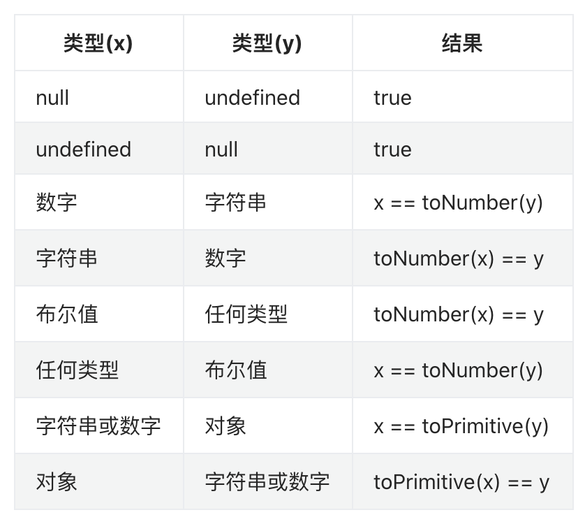


Q1: 判断是不是字符串数字？

```js
function testStringNum(str) {
  return !Number.isNaN(+str)
}
```


### 原型

#### js 原型和原型链的理解

js 原型是指为其它对象提供共享属性访问的对象。在创建对象时，每个对象都包含一个隐式引用(`__proto__`)指向它的原型对象或者null(`Object.prototype`)

原型链：原型也是对象，因此它也有自己的原型。这样就构成了一个原型链。

#### 原型链有什么作用？

在访问一个对象的属性时，实际上是在查询原型链。这个对象是原型链的第一个元素，先检查它是否包含属性名，如果包含则返回属性值，否则检查原型链上的第二个元素，以此类推。

#### 如何实现原型继承？

有两种方式。一种是通过 Object.create 或者 Object.setPrototypeOf 显式继承另一个对象，将它设置为原型。

另一种是通过 constructor 构造函数，在使用 new 关键字实例化时，会自动继承 constructor 的 prototype 对象，作为实例的原型。

在 ES2015 中提供了 class 的风格，背后跟 constructor 工作方式一样，写起来更内聚一些。

#### **你能说一个原型里比较少人知道的特性吗？**

在 ES3 时代，只有访问属性的 get 操作能触发对原型链的查找。在 ES5 时代，新增了 accessor property 访问器属性的概念。它可以定义属性的 getter/setter 操作。

具有访问器属性 setter 操作的对象，作为另一个对象的原型的时候，设置属性的 set 操作，也能触发对原型链的查找。

普通对象的 __proto__ 属性，其实就是在原型链查找出来的(`get __proto__`)，它定义在 Object.prototype 对象上。

### 闭包

闭包是指有权访问另一个函数作用域中的变量的函数。	

闭包是基于词法作用域书写代码时所产生的自然结果。当函数记住并访问所在的词法作用域(词法环境[[Environment]])，闭包就产生了。

Q：为什么说JavaScript中函数都是天生闭包的？

A：JavaScript 中的函数会自动通过隐藏的 `[[Environment]]` 属性记住创建它们的位置，所以它们都可以访问外部变量，能访问外部变量就产生了闭包。

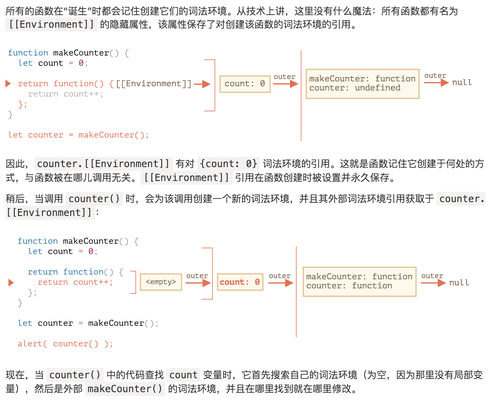

注意：

如果我们使用 `new Function` 创建一个函数，那么该函数的 `[[Environment]]` 并不指向当前的词法环境，而是指向全局环境。

因此，此类函数无法访问外部（outer）变量，只能访问全局变量。

缓存一些变量，可以用闭包，不一定非要用类的方式去缓存


### 作用域链

函数的作用域在函数定义的时候就决定了。

作用域链，是函数执行上下文中的一部分。当查找变量的时候，会先从当前上下文的变量对象中查找，如果没有找到，就会从父级(词法层面上的父级)执行上下文的变量对象中查找，一直找到全局上下文的变量对象，也就是全局对象。这样由多个执行上下文的变量对象构成的链表就叫做作用域链。


### this

函数的执行上下文联系在一起，普通函数执行指向调用函数的对象

new调用构造函数，指向实例化的对象

箭头函数没有this，它只会从自己的作用域链的上一层继承this

bind，call，apply指向指定的this


### 执行上下文

执行函数前的准备工作，也就是函数的执行环境

在 ES5 中，我们改进了命名方式，把执行上下文最初的三个部分改为下面这个样子。

- lexical environment：词法环境，当获取变量时使用，也叫作用域链
- variable environment：变量环境，当声明变量时使用，变量对象
- this value：this 值。

在 ES2018 中，执行上下文又变成了这个样子，this 值被归入 lexical environment，但是增加了不少内容。

- lexical environment：词法环境，当获取变量或者 this 值时使用。
- variable environment：变量环境，当声明变量时使用。
- code evaluation state：用于恢复代码执行位置。
- Function：执行的任务是函数时使用，表示正在被执行的函数。
- ScriptOrModule：执行的任务是脚本或者模块时使用，表示正在被执行的代码。
- Realm：使用的基础库和内置对象实例。
- Generator：仅生成器上下文有这个属性，表示当前生成器。

词法环境

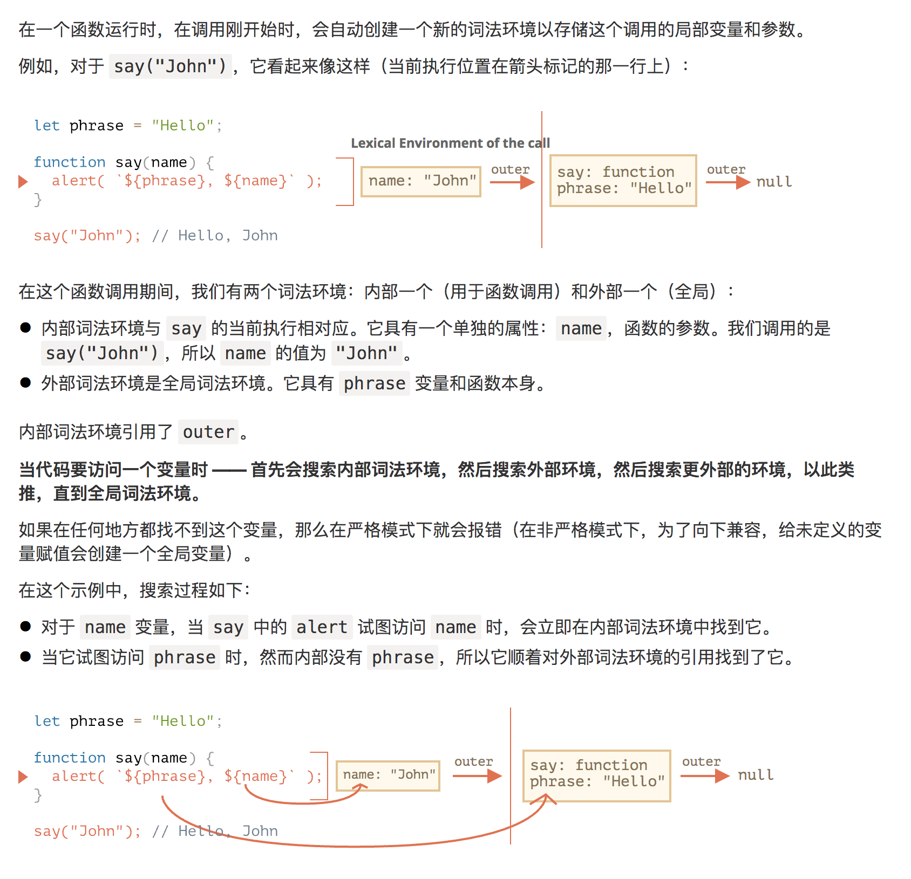


### new

当一个函数被使用 `new` 操作符执行时，它按照以下步骤：

1. 生成一个新对象
2. 链接到原型
3. 绑定this，函数体执行
4. 如果函数返回的是对象，返回这个对象，否则返回自己生成的对象

Q：如何保证函数必须要用new调用

A：

```js
function User() {
  if (!new.target) { // 如果你没有通过 new 运行我
    throw new TypeError("Cannot call a class as a function");
  }
  ...
}
  
// 或者用这种方法
function User() {
  if (!(this instanceof User)) {
    throw new TypeError("Cannot call a class as a function");
  }
  ...
}
```


Q：如何实现一个`new`函数呢？

A：

```js
function _new(Constructor, ...args) {
  const obj = Object.create(Constructor.prototype);
  const res = Constructor.apply(obj, args);
  return res instanceof Object ? res : obj;
}
```


### 深浅拷贝

#### 深拷贝

```js
function deepClone(obj) {
  if (typeof obj !== 'object' || obj === null) return obj;
  
  let copy = {};
  
  if (Array.isArray(obj)) {
   	copy = [];
  }
  
  for (const [key, value] of (Array.isArray(obj) ? obj.entries() : Object.entries(obj))) {
    copy[key] = deepClone(value);
  }
  
  return copy;
}
```

#### 浅拷贝

```js
const extend = Object.assign || ((obj, ...args) => {
  if (args.length !== 0) {
    for (const source of args) {
      for (const [key, value] of Object.entries(source)) {
        obj[key] = value;
      }
    }
  }
   return obj;
 })
```


### 节流

把多个事件控制在ms执行分片执行，用加锁的方法来控制节流

比如300ms执行一次，那在1000ms内，如果你触发了10次事件，但也只会执行3次

```js
function throttle(fn, ms = 300) {
  let canRun = true;
  return function() {
    if (!canRun) {
      return;
    }
    canRun = false;
    setTimeout((...args) => {
      fn.apply(this, args);
      canRun = true;
    }, ms);
  }
}
```


### 防抖

连续事件触发结束后只触发一次，用去除定时器的方法

```js
function debounce(fn, ms) {
  let timeout = null;
  return function(...args) {
    timeout && clearTimeout(timeout);
    timeout = setTimeout(() => {
      fn.apply(this, args);
    },ms);
  }
}
```


### 继承

#### 原型继承

JavaScript通过`[[Prototype]]`实现原型继承，也就是`__proto__`

通过 Object.create 或者 Object.setPrototypeOf 显式继承另一个对象，将它设置为原型

```js
const superObj = {a: 1};
const subObj = Object.create(superObj);
subObj.__proto__ === superObj;// true;
```

或者通过 constructor 构造函数，在使用 new 关键字实例化时，会自动继承 constructor 的 prototype 对象，作为实例的原型

#### 类继承

class extends 方式继承，本质上也是基于原型

实现方式

步骤：

1、原型继承

`subClass.prototype.__proto__ === superClass.prototype `

subClass.prototype = Object.create(superClass.prototype); 

`subClass.__proto__ === superClass`

Object.setPrototypeOf(subClass, superClass);

 2、调用父类构造函数

_this = _possibleConstructorReturn(this, Super.call(this, name));

实现 A extends B

es6

```js
class A {
  constructor(opt) {
    this.name = opt.name;
  }
}
class B extends A {
  constructor() {
    // 向父类传参
    super({ name: 'B' });
    // this 必须在 super() 下面使用
    console.log(this);
  }
}
```

es5

```js
function _extends(child, parent) {
  child.prototype = Object.create(parent.prototype);
  child.prototype.constructor = child;
  Object.setPrototypeOf(child, parent);
}

function _checkConstructorReturn(self, call) {
  if (call && (typeof(call) === 'object' || typeof call === 'function')) {
    return call;
  }
  if (self !== undefined) {
    return self;
  }
}

var A = (function() {
  return function A(opt) {
    this.name = opt.name
  }
})();

var B = (function(_super) {
  _extends(A, _super);
  
  function B(opt) {
    let _this;
    _this = _checkConstructorReturn(this, _super.call(this, opt));
    return _this;
  }
  
  return B;
})(A)
```


### 事件循环

浏览器中 JavaScript 的执行流程和 Node.js 中的流程都是基于 **事件循环** 的。

它是一个在 JavaScript 引擎等待任务，执行任务和进入休眠状态等待更多任务这几个状态之间转换的无限循环。

引擎的一般算法：

1. 当有任务时，从最先进入的任务开始执行。
2. 休眠直到出现任务，然后转到第 1 步。

设置任务 —— 引擎处理它们 —— 然后等待更多任务（即休眠，几乎不消耗 CPU 资源）

注意：

- 引擎执行任务时永远不会进行渲染（render）。如果任务执行需要很长一段时间也没关系。仅在任务完成后才会绘制对 DOM 的更改。
- 如果一项任务执行花费的时间过长，浏览器将无法执行其他任务，无法处理用户事件，因此，在一定时间后浏览器会在整个页面抛出一个如“页面未响应”之类的警报，建议你终止这个任务。

所以，一般是一个任务结束后，清空微任务队列，然后就进行页面渲染，因为js线程和渲染ui线程互斥，当js线程运行的时候，ui线程处于冻结状态。

#### 任务

**任务** 就是由执行诸如从头执行一段程序、执行一个事件回调或一个 interval/timeout 被触发之类的标准机制而被调度的任意 JavaScript 代码。这些都在 **任务队列（task queue）**上被调度。

任务也称为宏任务，一般下面几种都是宏任务

- script 脚本
- click、mousemove等交互事件
- ajax
- setTimeout
- ...

多个任务组成了一个队列，即所谓的“宏任务队列”，即为**macroTask queue**

#### 微任务

每当一个任务存在，事件循环都会检查该任务是否正把控制权交给其他 JavaScript 代码。如若不然，事件循环就会运行微任务队列中的所有微任务。

在任务队列中的一个任务执行完后，就会清空当前微任务队列所有的微任务。

微任务为以下这种

- Promise
- queueMicrotask
- ...


### 模块化

IFEE

AMD

Commomjs

EsModule

UMD


## 网络

### 缓存策略

缓存是优化系统性能的重要手段，HTTP 传输的每一个环节中都可以有缓存；

服务器使用“Cache-Control”设置缓存策略，常用的是“max-age”，表示资源的有效期；

浏览器收到数据就会存入缓存，如果没过期就可以直接使用，过期就要去服务器验证是否仍然可用；

验证资源是否失效需要使用“条件请求”，常用的是“if-Modified-Since”和“If-None-Match”，收到 304 就可以复用缓存里的资源；

验证资源是否被修改的条件有两个：“Last-modified”和“ETag”，需要服务器预先在响应报文里设置，搭配条件请求使用；浏览器也可以发送“Cache-Control”字段，使用“max-age=0”或“no_cache”刷新数据。

HTTP 缓存看上去很复杂，但基本原理说白了就是一句话：“没有消息就是好消息”，“没有请求的请求，才是最快的请求。”


#### 有了【`Last-Modified，If-Modified-Since`】为何还要有【`ETag、If-None-Match`】

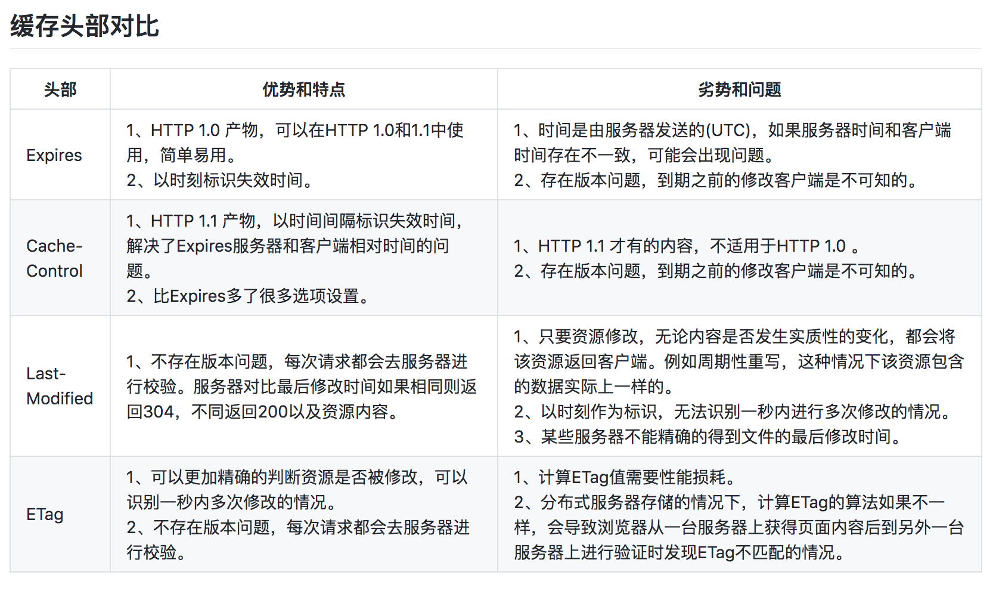


#### 强缓存和协商缓存

强缓存：Cache-Control、Expires

协商缓存：Last-Modified/If-Modified-Since、ETag/If-None-Match

#### 其它问题

QA：遇到的缓存问题

1.from disk cache 和 from memory cache 区别

都使用了强缓存

内存缓存(from memory cache)和硬盘缓存(from disk cache)

在浏览器中，浏览器会在js和图片等文件解析执行后直接存入内存缓存中，那么当刷新页面时只需直接从内存缓存中读取(from memory cache)；而css文件则会存入硬盘文件中，所以每次渲染页面都需要从硬盘读取缓存(from disk cache)

2.只设置Etag，那么为什么在 Chrome 下会有非验证性缓存呢？

没有设置 Cache-Control 这个头，其默认值是 Private ，在标准中明确说了：

> Unless specifically constrained by a cache-control
> directive, a caching system MAY always store a successful response

如果没有 Cache-Control 进行限制，缓存系统**可以**对一个成功的响应进行存储

很显然， Chrome 是遵守标准的，它在没有检查到 Cache-Control 的时候对响应做了非验证性缓存，所以你看到了 200 from memory cache
同时 Safari 也是遵守标准的，因为标准只说了**可以**进行存储，而非**应当**或者**必须**，所以 Safari 不进行缓存也是合理的

我们可以理解为，没有 Cache-Control 的情况下，缓存不缓存就看浏览器高兴，你也没什么好说的。那么你如今的需求是“明确不要非验证性缓存”，则从标准的角度来说，你**必须**指定相应的 Cache-Control 头

3.常见Cache-Control 的 max-age 有效值设置

365天

```
Cache-Control：max-age = 315360000
```

30天

```
Cache-Control：max-age = 25920000
```

4.Response Header 中 Age 与 Date

Age表示命中代理服务器的缓存. 它指的是代理服务器对于请求资源的已缓存时间, 单位为秒.

Date指的是响应生成的时间，请求经过代理服务器时, 返回的Date未必是最新的, 通常这个时候, 代理服务器将增加一个Age字段告知该资源已缓存了多久。


###  GET和POST的区别

get和post没有本质上的区别，只有报文的形式不同

get和post是http协议中的两种，无论是get还是post，用的都是一种传输协议，在传输上，其实没有区别，get请求也可以传输body，只不过被浏览器禁止了。

不过要说区别，主要是规范上的区别

下面这些都是基于规范上的区别

- GET是拿数据，POST是提交数据

- GET在浏览器回退时时无害的，而POST会再次提交请求
- GET产生URL地址可以被收藏，而POST不可以
- GET请求会被浏览器主动缓存，而POST不会，除非手动设置
- GET只能进行url编码，而POST支持多种编码方式
- GET请求参数会被完整保留在浏览器历史记录里，而POST中的参数不会被保留
- GET请求在URL中传送的参数是有长度限制的，而POST没有限制
- 对参数的数据类型，GET只接受ASCII字符，而POST没有限制
- GET比POST更不安全，因为参数直接暴露在URL上，所以不能用来传递敏感信息
- GET参数通过URL传递，POST放在Request Body中


### TCP

TCP，传输控制协议，是一种面向连接的、可靠的、基于字节流的传输层协议。

#### 三次握手

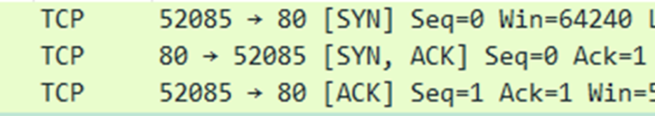

第一次握手：客户端发送一个SYN码（当SYN=1，ACK=0时，表示当前报文段是一个连接请求报文。当SYN=1，ACK=1时，表示当前报文段是一个同意建立连接的应答报文），要求建立数据连接

第二次握手：服务器如果同意连接，向客户端发送SYN+ACK的应答码

第三次握手：客户端再次发送ACK向服务器，服务器验证ACK没有问题，则建立连接


#### 四次挥手

第一次挥手：客户端发送FIN报文给服务端，通知服务器数据已经传输完毕

第二次挥手：服务器接收到之后，发送ACK给客户端，数据还没传输完成

第三次挥手：服务器已经传输完毕，再次发送FIN+ACK通知客户端，数据已经传输完毕

第四次挥手：客户端再次发送ACK，进入TIME_WAIT状态，服务端关闭，客户端等待2MSL后关闭

为什么客户端要等到2MSL后再关闭？

等待2MSL时间主要目的是怕最后一个ACK包对方没收到，那么对方在超时后将重发第三次握手的FIN包，主动关闭端接到重发的FIN包后可以再发一个ACK应答包。


### UDP

UDP 协议是面向无连接的，也就是说不需要在正式传递数据之前先连接起双方。


### 


### 状态码。`302.304.301.401.403`的区别？

- 200 OK：客户端请求成功
- 206 Partial Content：客户发送了带有Range头的GET请求，服务端完成了它(场景用于大视频的请求)
- 301 Moved Permanently：所请求的页面已经永久转移致新的url **永久重定向**
- 302 Found：所请求的页面已经临时转移至新的url **临时重定向**
- 304 Not Modified：客户端有缓冲的文档并发出了一个条件性的请求，服务端告诉客户，原来缓存的文档还可以继续使用
- 400 Bad Request：客户端请求有语法错误，不能被服务端所解析
- 401 Unauthriozed：请求未经授权，这个状态码必须和WWW-Authenticate报头一起用
- 403 Forbidden：对被请求页面的访问已被禁止
- 404 Not Found：请求资源不存在
- 500 Internal Server Error：服务器发生不可预期的错误，原来缓冲的文档还可以继续使用
- 503 Server Unavailable：请求未完成，服务器临时过载或宕机，一段时间后可能恢复正常


### HTTP的持久连接

HTTP协议采用“请求-应答”模式，当使用普通模式，即非Keep-Alive模式时，每个请求/应答客户和服务器都要新建一个连接，完成后立即断开连接（HTTP协议为无连接协议）

当使用Keep-Alive模式（又称持久连接、连接重用）时，Keep-Alive功能使客户端到服务端的连接持续有效，当出现对服务器的后续请求时，Keep-Alive功能避免了建立或者重新建立连接


### 一个TCP连接能发几个http请求

http1.0：一个tcp连接只能发一个http请求

http1.1：默认开启Connection:keep-alive，一个tcp连接可以发多个http请求，但是多个请求是串行执行

http2.0：引入了多路复用和二进制分帧，一个tcp连接可以并发多个http请求，请求和响应是并行执行


### 如何前后端配合自定义请求响应头字段

前端如果要获取`response header`里面的值，可以通过`XMLHttpRequest`实例的`getResponseHeader()`方法进行获取，但是根据[w3c-cors标准](https://www.w3.org/TR/2014/REC-cors-20140116/)，参考**7.1.1**，可以看出不是所有的请求头字段都可以获取到，只有`simple-response-header`和设置了`Access-Control-Expose-Headers`指定字段才可以被`getResponseHeader()`获取到，关于`simple-response-header`有以下这几种：

- Cache-Control
- Content-Language
- Content-Type
- Expires
- Last-Modified
- Pragma

这几种都可以获取到。

但是，如果我想自定义一个字段，就需要和后端配合`Access-Control-Expose-Headers`来实现

比如在`koa`中，设置对应的字段即可：

```js
router.get('/get', async (ctx, next) => {
  ctx.set('Access-Control-Expose-Headers', 'token')
  ctx.set('token', '123456')
  ctx.body = 'success'
  await next()
});
```

使用`axios`请求就能在返回的对象`headers`字段中获取：

```js
axios.get('/get').then(res => {
  console.log(res.headers.token); // '123456'
})
```


### OPTIONS预请求

跨源资源共享标准新增了一组 HTTP 首部字段，允许服务器声明哪些源站通过浏览器有权限访问哪些资源。另外，规范要求，对那些可能对服务器数据产生副作用的 HTTP 请求方法（特别是 [`GET`](https://developer.mozilla.org/zh-CN/docs/Web/HTTP/Methods/GET) 以外的 HTTP 请求，或者搭配某些 MIME 类型的 [`POST`](https://developer.mozilla.org/zh-CN/docs/Web/HTTP/Methods/POST) 请求），浏览器必须首先使用 [`OPTIONS`](https://developer.mozilla.org/zh-CN/docs/Web/HTTP/Methods/OPTIONS) 方法发起一个预检请求（preflight request），从而获知服务端是否允许该跨源请求。服务器确认允许之后，才发起实际的 HTTP 请求。

1、使用了这些请求方法：PUT/DELETE/CONNECT/OPTIONS/TRACE/PATCH

2、人为设置了以下集合之外的请求头

- Accept

- Accept-Language
- Content-Language
- Content-Type
- DPR
- Downlink
- Save-Data
- Viewport-Width
- Width

3、Content-Type 不属于以下这几种

- application/x-www-form-urlencoded
- multipart/form-data
- text/plain


### HTTP1.0/1.1/2.0区别

http1.0特性

- 无状态：服务器不跟踪不记录请求过的状态
- 无连接：浏览器每次请求都需要建立tcp连接

无状态

对于无状态的特性可以借助cookie/session机制来做身份认证和状态记录

无连接

无连接导致的性能缺陷有两种：

**无法复用连接**
每次发送请求，都需要进行一次tcp连接（即3次握手4次挥手），使得网络的利用率非常低

**队头阻塞**

http1.0规定在前一个请求响应到达之后下一个请求才能发送，如果前一个阻塞，后面的请求也给阻塞的

Http1.1也存在队头阻塞的问题，无法同时处理超过一小批的请求（通常一次处理6个请求，但因浏览器而导）

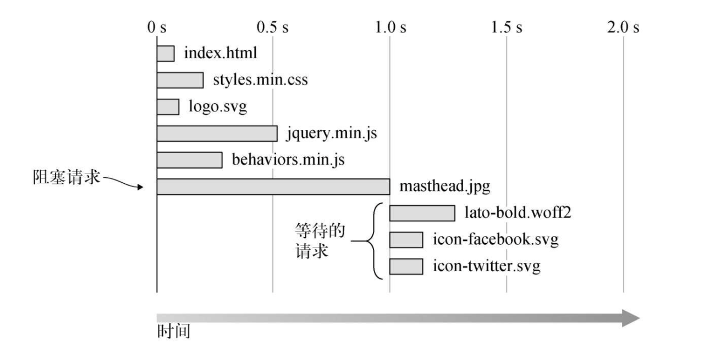

http1.1特性

为了解决http1.0的性能缺陷，http1.1出现了

http1.1特性：

- 长连接：新增Connection字段，可以设置keep-alive值保持连接不断开
- 管道化：基于上面长连接的基础，管道化可以不等第一个请求响应继续发送后面的请求，但响应的顺序还是按照请求的顺序返回
- 缓存处理：新增字段cache-control
- 断点传输：增加range头域，允许只请求资源的某个部分，返回码是206

长连接

http1.1默认保持长连接，数据传输完成保持tcp连接不断开,继续用这个通道传输数据

管道化

基于长连接的基础，我们先看没有管道化请求响应：

tcp没有断开，用的同一个通道

```
请求1 > 响应1 --> 请求2 > 响应2 --> 请求3 > 响应3
```

管道化的请求响应：

```
请求1 --> 请求2 --> 请求3 > 响应1 --> 响应2 --> 响应3
```

即使服务器先准备好响应2,也是按照请求顺序先返回响应1

虽然管道化，可以一次发送多个请求，但是响应仍是顺序返回，仍然无法解决队头阻塞的问题

缓存处理

HTTP1.0缓存使用Expires和header里的Last-Modified，HTTP2.0则增加了Cache-Control和Etag

断点传输

在上传/下载资源时，如果资源过大，将其分割为多个部分，分别上传/下载，如果遇到网络故障，可以从已经上传/下载好的地方继续请求，不用从头开始，提高效率

在 Header 里两个参数实现的，客户端发请求时对应的是 Range 服务器端响应时对应的是 Content-Range

http2.0特性

- 二进制分帧：将所有传输的信息分割为更小的消息和帧，并对它们采用二进制格式的编码
- 多路复用： 一个TCP连接可以并发处理多个请求，基于二进制分帧，在同一域名下所有访问都是从同一个tcp连接中走，http消息被分解为独立的帧，乱序发送，服务端根据标识符和首部将消息重新组装起来
- 头部压缩：压缩HTTP请求和响应的首部
- 服务器推送：服务器可以额外的向客户端推送资源，而无需客户端明确的请求

多路复用

在“流”的层面上看，消息是一些有序的“帧”序列，而在“连接”的层面上看，消息却是乱序收发的“帧”。多个请求 / 响应之间没有了顺序关系，不需要排队等待，也就不会再出现“队头阻塞”问题，降低了延迟，大幅度提高了连接的利用率


区别

1. http1.0 到http1.1的主要区别，就是从无连接到长连接
2. http2.0对比1.X版本主要区别就是多路复用


HTTP2.0的多路复用和HTTP1.X中的长连接复用有什么区别？

HTTP/1.1 Pipeling解决方式为，若干个请求排队串行化单线程处理，后面的请求等待前面请求的返回才能获得执行机会，一旦有某请求超时等，后续请求只能被阻塞，毫无办法，也就是人们常说的线头阻塞；

HTTP/2多个请求可同时在一个连接上并行执行。某个请求任务耗时严重，不会影响到其它连接的正常执行；


### HTTPS

HTTP是明文传输，所以不安全

HTTPS的语法、语义仍然是HTTP，但把下层的协议由TCP/IP换成了SSL/TLS

TLS实际上SSL改名而来

对称加密：

对称加密就是两边拥有相同的秘钥，两边都知道如何将密文加密解密

非对称加密：

有公钥和私钥之分，公钥加密，私钥解密


## 安全

### `XSS` 跨站脚本攻击

就是攻击者想办法将一段可以执行的代码注入到网页中

比如在输入框中，输入`<script>console.log('xxx')</script>`

如何防御？

对用户输入的内容进行转移字符，可以使用`js-xss`库

开启CSP，建立白名单，告诉浏览器哪些资源可以加载

### `CSRF` 跨站请求伪造

攻击者构造出一个后端请求地址，诱导用户点击或者通过某种手段发起请求

如果用户是在登录状态情况下，请求地址的后端误以为是用户在操作

如何防御？

1、get请求不对数据进行修改

2、不让第三方网站访问到用户cookie

3、阻止第三方网站请求接口

4、同域请求时附带验证信息token（axios的做法）

5、浏览器开启SameSite属性，跨域不能传cookie，服务端也可以设置

6、服务端开启http-only，脚本无法访问cookie

如果攻击者有权限在本域发布评论（含链接、图片等，统称UGC），那么它可以直接在本域发起攻击，这种情况下同源策略无法达到防护的作用。防止同源CSRF就必须使用token验证的方式。


## css

### BFC

BFC：块级格式化上下文

- float属性不为none
- position为absolute或fixed
- display为inline-block, table-cell, table-caption, flex, inline-flex
- overflow不为visible。

用途

- 清除元素内部浮动
- 解决外边距合并(塌陷)问题
- 制作右侧自适应的盒子问题

### css盒模型

所有HTML元素可以看作盒子，在CSS中，"box model"这一术语是用来设计和布局时使用。

CSS盒模型本质上是一个盒子，封装周围的HTML元素，它包括：边距，边框，填充，和实际内容。

盒模型允许我们在其它元素和周围元素边框之间的空间放置元素。

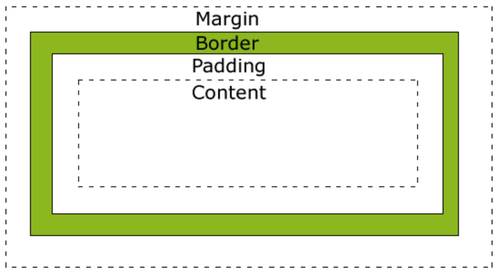

盒模型又分2种

w3c盒模型 content-box

属性width、height只包含内容content，不包含border和padding

IE盒模型 border-box

属性width、height包含border和padding

### flex

flex简写属性包括

- flex-grow 初始值为0
- flex-shrink 初始值为1
- flex-basis  初始值auto

单值语法：

- flex number:  flex number 1 0

- flex: initial: flex 0 1 auto
- flex: auto: flex 1 1 auto
- flex: none: flex 0 0 auto

双值语法: 

第一个值必须为一个无单位数，并且它会被当作 `<flex-grow>` 的值。第二个值必须为以下之一：

- 一个无单位数：它会被当作 `<flex-shrink>` 的值。
- 一个有效的宽度值: 它会被当作 `<flex-basis>` 的值。

三值语法:

- 第一个值必须为一个无单位数，并且它会被当作 `<flex-grow>` 的值。
- 第二个值必须为一个无单位数，并且它会被当作 `<flex-shrink>` 的值。
- 第三个值必须为一个有效的宽度值， 并且它会被当作 `<flex-basis>` 的值。


## vue

### 为什么vue组件中的data必须是个函数？

答：注册组件的本质实际上是建立一个组件构造器的引用，在使用时才会去实例化。也就是生成一个function。

下面就关于原型的知识了

​		组件data属性实际上在挂载到 构造器function.prototype上的，比如

```js
const Comp = function () {}

Comp.prototype.data = ...
```

​		如果该原型下的data属性值为**对象**

```js
// 创建构造器Comp
Vue.component('Comp', {
  data: {
    a: 1,
    b: 2
  }
})

const Comp = function ({ data }) {
  // 类似于这种
  this.data = this.data;
}

// 简化后的代码实际上是这个
// 取到注册对象 data 属性并挂载到构造器原型上
Comp.prototype.data = {
  a: 1,
  b: 2
}

// 如果多次实例化
const compA = new Comp();
const compB = new Comp();

compA.data === compB.data; // true 两者共同指向同一地址
compA.data.c = 3;
console.log(compB.data.c); // 3 (这样就容易引起麻烦)

```

​		

为了避免引发上述的麻烦，通过函数独立作用域便可解决


```js
// 创建构造器Comp
Vue.component('Comp', {
  data() {
    // 每次调用都返回一个新的对象
    return {
      a: 1,
    	b: 2
    }
  }
})

const Comp = function ({ data }) {
  // 调用原型 data 函数，每个组件实例都有各自的数据副本，避免数据互相影响
  this.data = this.data();
}

Comp.prototype.data = function () {
  a: 1,
  b: 2
}

const compA = new Comp();
const compB = new Comp();

compA.data === compB.data; // false

```


### nextTick

将回调推迟到下一个 DOM 更新周期之后执行。在更改了一些数据以等待 DOM 更新后立即使用它。

Vue 在内部尝试对异步队列使用原生的 `Promise.then` 和 `MessageChannel`，如果执行环境不支持，会采用 `setTimeout(fn, 0)` 代替

源码

```js
export function nextTick (cb?: Function, ctx?: Object) {
  let _resolve
  // 加入到队列中
  // 前面的都是更新dom的函数
  // 所以执行完更新dom的函数，这个cb里就能拿到最新dom的值了
  callbacks.push(() => {
    if (cb) {
      try {
        cb.call(ctx)
      } catch (e) {
        handleError(e, ctx, 'nextTick')
      }
    } else if (_resolve) {
      _resolve(ctx) // 执行then回调函数
    }
  })
  // 上锁
  // 多次使用nextTick只需把cb加入队列中
  if (!pending) {
    pending = true
    timerFunc() // 异步执行
  }
  if (!cb && typeof Promise !== 'undefined') {
    return new Promise(resolve => {
      _resolve = resolve
    })
  }
}
```

为什么`vm.data = 'new value'`之后，不能拿到最新的值？

如果这么写，是不能拿到值的

```js
vm.data = 'new value';
console.log(dom.data); // 旧值，dom异步更新
```

更新dom是异步的，所以上面写法不能拿到最新的值，所以必须使用nextTick来把`console.log(dom.data)`放到回调队列中后面，也就是dom更新函数的后面。

```js
div.innerHTML = '123';
console.log(div.innerHTML); // '123'
```


vue为什么要使用异步更新队列？

避免频繁操作dom，更新dom

源于vue文档上的解释：Vue **异步**执行 DOM 更新。只要观察到数据变化，Vue 将开启一个队列，并缓冲在同一事件循环中发生的所有数据改变。如果同一个 watcher 被多次触发，只会被推入到队列中一次。这种在缓冲时去除重复数据对于避免不必要的计算和 DOM 操作上非常重要。然后，在下一个的事件循环“tick”中(也不一定是下一个事件循环，用了promise就是同个循环)，Vue 刷新队列并执行实际 (已去重的) 工作。

当状态发生改变的时候，vue采用异步执行dom更新

有篇文章写得很好，https://github.com/berwin/Blog/issues/22

主要是为了性能优化，减少无用的dom更新，例如

```js
vm.a = 1;
vm.a = 2;
vm.a = 3;
```

如果是每次数据改变，都要去更新dom的话，成本太高，其实用户要的只是最后一次更新，所以在同步任务中去用缓冲队列处理，然后通过异步来更新dom。

Vue优先将渲染操作推迟到本轮事件循环的最后，如果执行环境不支持会降级到下一轮

当同一轮事件循环中反复修改状态时，并不会反复向队列中添加相同的渲染操作，也就是render watcher


### Object.defineProperty 的缺陷

无法监测通过下标方式修改数组和对象新增属性

数组是通过改变数组的原型链，然后重写'push',  'pop',  'shift',  'unshift',  'splice',  'sort',  'reverse'这几个方法实现派发更新

可以使用this.$set来解决这类问题


### v-if和v-show

这两者的区别主要是，v-if是不渲染dom的，v-show是会渲染dom，不过dom的display:none;

再深入点说的话

v-if会调用addIfCondition方法，生成vnode的时候会忽略对应节点，render的时候就不会渲染

v-show会生成vnode，render的时候会渲染成真实节点，只是render过程中会在节点的属性中修改style值


### 编译、渲染和更新过程

首先谈下编译：

模板解析为AST，优化AST，将AST转化成render function string，也就对应着parse、optimize、generate函数

```js
export const createCompiler = createCompilerCreator(function baseCompile (
  template: string,
  options: CompilerOptions
): CompiledResult {
  const ast = parse(template.trim(), options)
  if (options.optimize !== false) {
    optimize(ast, options)
  }
  const code = generate(ast, options)
  return {
    ast,
    render: code.render,
    staticRenderFns: code.staticRenderFns
  }
})
```

**parse**

生成ast

```js
{
    // 类型
    type: 1,
    // 标签
    tag,
    // 属性列表
    attrsList: attrs,
    // 属性映射
    attrsMap: makeAttrsMap(attrs),
    // 父节点
    parent,
    // 子节点
    children: []
}
```

**optimize**

遍历递归每个ast节点，标记静态的节点，这些节点是不需要diff的

**generate**

接收ast，把ast转换成render字符串函数，比如`_c('div', [_c('span')])`

执行render函数，生成vnode，挂载到dom上

```js
const vnode = vm._render();
updateComponent = () => {
 vm._update(vnode, hydrating)
}

vm._update = function() {
  vm.$el = vm.__patch__(prevVnode, vnode); // 挂载dom
}
```

顺便看看$forceUpdate

原来$forceUpdate只会让当前组件的render watcher更新，仅仅影响实例本身和插入插槽内容的子组件，而不是所有子组件。

```js
Vue.prototype.$forceUpdate = function () {
 const vm: Component = this;
 if (vm._watcher) {
   vm._watcher.update();
  }
}
```


### diff算法

源码`core/vdom/patch.js`

为什么要diff？

减少dom的更新量，找到最小差异部分的dom，也就是尽可能的复用旧节点，最后只更新新的部分即可，节省dom的新增和删除等操作

新旧节点比较流程：

前置条件为sameVnode，则新旧节点相同，然后再去diff它们的子节点

如何判断相同节点？

```js
function sameVnode (a, b) {
  return (
    a.key === b.key && (
      (
        a.tag === b.tag &&
        a.isComment === b.isComment &&
        isDef(a.data) === isDef(b.data) &&
        sameInputType(a, b)
      ) || (
        isTrue(a.isAsyncPlaceholder) &&
        a.asyncFactory === b.asyncFactory &&
        isUndef(b.asyncFactory.error)
      )
    )
  )
}
```

接着，看看patch函数，也就是`Vue.prototype.__patch__`

```js
function patch (oldVnode, vnode, hydrating, removeOnly) {
    if (isUndef(vnode)) {
      if (isDef(oldVnode)) invokeDestroyHook(oldVnode)
      return
    }

    let isInitialPatch = false
    const insertedVnodeQueue = []

    // 如果没有旧节点，直接生成新节点
    if (isUndef(oldVnode)) {
      // empty mount (likely as component), create new root element
      isInitialPatch = true
      createElm(vnode, insertedVnodeQueue)
    } else {
      const isRealElement = isDef(oldVnode.nodeType)
      // 如果是一样的vnode，则比较它们的子节点
      if (!isRealElement && sameVnode(oldVnode, vnode)) {
        // patch existing root node
        patchVnode(oldVnode, vnode, insertedVnodeQueue, null, null, removeOnly)
      } else {
        if (isRealElement) {
          // mounting to a real element
          // check if this is server-rendered content and if we can perform
          // a successful hydration.
          if (oldVnode.nodeType === 1 && oldVnode.hasAttribute(SSR_ATTR)) {
            oldVnode.removeAttribute(SSR_ATTR)
            hydrating = true
          }
          if (isTrue(hydrating)) {
            if (hydrate(oldVnode, vnode, insertedVnodeQueue)) {
              invokeInsertHook(vnode, insertedVnodeQueue, true)
              return oldVnode
            } else if (process.env.NODE_ENV !== 'production') {
              warn(
                'The client-side rendered virtual DOM tree is not matching ' +
                'server-rendered content. This is likely caused by incorrect ' +
                'HTML markup, for example nesting block-level elements inside ' +
                '<p>, or missing <tbody>. Bailing hydration and performing ' +
                'full client-side render.'
              )
            }
          }
          // either not server-rendered, or hydration failed.
          // create an empty node and replace it
          oldVnode = emptyNodeAt(oldVnode)
        }

        // replacing existing element
        const oldElm = oldVnode.elm
        const parentElm = nodeOps.parentNode(oldElm)

        // create new node
        // 创建新节点
        createElm(
          vnode,
          insertedVnodeQueue,
          // extremely rare edge case: do not insert if old element is in a
          // leaving transition. Only happens when combining transition +
          // keep-alive + HOCs. (#4590)
          oldElm._leaveCb ? null : parentElm,
          nodeOps.nextSibling(oldElm)
        )

        // update parent placeholder node element, recursively
        if (isDef(vnode.parent)) {
          let ancestor = vnode.parent
          const patchable = isPatchable(vnode)
          while (ancestor) {
            for (let i = 0; i < cbs.destroy.length; ++i) {
              cbs.destroy[i](ancestor)
            }
            ancestor.elm = vnode.elm
            if (patchable) {
              for (let i = 0; i < cbs.create.length; ++i) {
                cbs.create[i](emptyNode, ancestor)
              }
              // #6513
              // invoke insert hooks that may have been merged by create hooks.
              // e.g. for directives that uses the "inserted" hook.
              const insert = ancestor.data.hook.insert
              if (insert.merged) {
                // start at index 1 to avoid re-invoking component mounted hook
                for (let i = 1; i < insert.fns.length; i++) {
                  insert.fns[i]()
                }
              }
            } else {
              registerRef(ancestor)
            }
            ancestor = ancestor.parent
          }
        }

        // destroy old node
        // 销毁旧节点
        if (isDef(parentElm)) {
          removeVnodes([oldVnode], 0, 0)
        } else if (isDef(oldVnode.tag)) {
          invokeDestroyHook(oldVnode)
        }
      }
    }

    invokeInsertHook(vnode, insertedVnodeQueue, isInitialPatch)
    // vm.$el
    return vnode.elm
  }
```

源码太长，精简一下

```js
function patch(oldVnode, vnode) {
  if (!oldVnode) {
    createElm(vnode);
  } else if (sameVnode(oldVnode, vnode)) {
    patchVnode(oldVnode, vnode);
  } else {
    createElm(vnode);
    removeVnodes(oldVnode);
  }
  
  return vnode.elm;
}
```

patch函数其实就是分为三个流程

1、没有旧节点，直接全部新建

2、旧节点和新节点自身一样，则去比较它们的子节点

3、旧节点和新节点不一样，则创建新节点，删除旧节点

第二个流程中，子节点的diff（新旧节点必须是sameVnode）

比较新旧节点的子节点，核心就是`updateChildren`函数，循环对比

简单概况就是：

1、先找到不需要移动的相同节点（新头旧头、新尾旧尾判断），消耗最小

2、再找相同但是需要移动的节点（新头旧尾、新尾旧头、单个查找），消耗第二小

3、最后找不到，才会去新建删除节点，保底处理

再细说下：

1、旧头和新头比较，如果一样则不移动

2、旧尾和旧尾比较，如果一样则不移动

3、旧头和新尾比较，如果一样则操作dom，把旧头移动到尾部

4、旧尾和新头比较，如果一样则操作dom，把旧尾移动到头部

5、拿新节点去旧子节点数组中遍历，存在且sameNode为true就移动旧节点，不存在就新建节点

6、如果新子节点遍历完了，旧子节点有剩余，让dom逐个删除旧节点

7、如果旧子节点遍历完了，新子节点有剩余，全部新建子节点

这样diff的原因，就是为了更高效找到和新节点一样的旧节点，然后只需要移动位置就可以了，避免了重新创建/删除dom

参考文章

https://zhuanlan.zhihu.com/p/81752104

https://ustbhuangyi.github.io/vue-analysis/v2/reactive/component-update.html


抛出几个问题

为什么v-for要加key？

答：为了复用旧节点vnode，避免组件的重新创建和销毁，提高性能。因为判断是否为同个节点sameVnode函数，有一项是根据key来进行判断的，如果没有key，那就等于全部组件节点都要重新创建和销毁，如果提供了key，新旧节点是一样，最多就移动下位置就可以了。

为什么不要用索引index、随机数当key？

答：同样是无法达到性能上的优化，有几种情况，分点讨论

1、如果渲染数组的顺序翻转，index值虽然不会变，节点内容改变了，如果是纯标签`<li>`这些，vue就直接改变元素内容，但是，如果是组件，有props的情况下，diff过程会发现props的改变，然后触发组件的视图重新渲染，必然会导致dom的操作。

2、如果是在数组`[1,2,3]`中插入一个值，变成`[1,4,2,3]`，那么之前`2,3`组件的索引(key)由`1,2`变成`2,3`，key变了，sameVnode肯定为false，本来只需要新建1个组件，现在变成要新建3个，更新成本增加。

3、看看这种情况

```vue
<div id="app">
 <ul>
  <li v-for="(val, idx) in arr" :key="idx">
   <comp :val="idx"/>
  </li>
  <button @click="test">测试</button>
 </ul>
</div>
<script>
const app = new Vue({
  el: '#app',
  data() {
  return {
   arr: [1,2,3]
  	}
  },
  methods: {
   test() {
    this.arr.splice(0,1);
   }
  },
  components: {
   comp: {
    props: ['val'],
    template: `<span>{{val}}</span>`
   }
  }
});
</script>
```

如果是数组`[1,2,3]`，使用`splice(0,1)`删除第一个节点，之前节点索引key为`[1,2,3] -> 0,1,2`，现在变成`[2,3] -> 0,1`，经过vue的比较逻辑，因为key都有`0,1`，所以vue会认为前面2个节点都没变，变得是少了key为2的节点，也就是最后一个，所以前面2个节点直接复用，在上面demo页面中你会发现vue就把最后一个节点给删了。

但是，如果你直接使用`<li v-for="(val, idx) in arr" :key="idx">{{idx}}</li>`，你会察觉不到是删了最后一个节点，因为vue在diff过程中，发现了`li`是文本节点，在`patchVnode`函数有段逻辑

```js
if (oldVnode.text !== vnode.text) {
 nodeOps.setTextContent(elm, vnode.text)
}
```

`[1,2,3] -> [2,3]`，数组文本改变，直接更新dom，所以你无法察觉，但是底层是删除了最后一个元素，所以啊，还是给一个稳定的id做key吧~

再说说随机数的情况

用随机数的话，这样新旧vnode的key全都不一样，很尴尬，vue直接判断全都不是sameVnode，全部重头再来~

### Vue._init

看vue的_init函数分析vue初始化的时序

在`new Vue()`中，会执行`this._init()`

**beforeCreate**

initLifecycle(vm) 初始化生命周期

initEvents(vm) 初始化事件系统

initRender(vm) 初始化render方法，例如$createElement

**created**

initInjections(vm) 初始化inject

initState(vm) 初始化props、data、methods

initProvide(vm) 初始化provide

**beforeMount**

完成模板编译，生成render函数

**mounted**

生成vnode

更新dom完成挂载

```js
Vue.prototype._init = function (options?: Object) {
    const vm: Component = this
    // a uid
    vm._uid = uid++

    let startTag, endTag
    /* istanbul ignore if */
    if (process.env.NODE_ENV !== 'production' && config.performance && mark) {
      startTag = `vue-perf-start:${vm._uid}`
      endTag = `vue-perf-end:${vm._uid}`
      mark(startTag)
    }

    // a flag to avoid this being observed
    // 标识该实例对象避免成为响应式对象
    vm._isVue = true
    // merge options
    if (options && options._isComponent) {
      // optimize internal component instantiation
      // since dynamic options merging is pretty slow, and none of the
      // internal component options needs special treatment.
      initInternalComponent(vm, options)
    } else {
      vm.$options = mergeOptions(
        resolveConstructorOptions(vm.constructor),
        options || {},
        vm
      )
    }
    /* istanbul ignore else */
    if (process.env.NODE_ENV !== 'production') {
      initProxy(vm)
    } else {
      vm._renderProxy = vm
    }
    // expose real self
    // 同步按顺序初始化
    vm._self = vm
    initLifecycle(vm) // 初始化生命周期
    initEvents(vm) // 初始化事件
    initRender(vm) // 初始化渲染器
    callHook(vm, 'beforeCreate') // hook beforeCreate
    initInjections(vm) // resolve injections before data/props
    initState(vm) // 初始化 props、methods、data
    initProvide(vm) // resolve provide after data/props
    callHook(vm, 'created') // hook created，created生命周期data响应式对象、methods、props已经初始化完成

    /* istanbul ignore if */
    if (process.env.NODE_ENV !== 'production' && config.performance && mark) {
      vm._name = formatComponentName(vm, false)
      mark(endTag)
      measure(`vue ${vm._name} init`, startTag, endTag)
    }

    // 挂载到dom上
    if (vm.$options.el) {
      vm.$mount(vm.$options.el)
    }
  }
```


### 父子组件生命周期执行顺序

父组件先创建，然后子组件创建，子组件挂载，然后父组件挂载

父beforeCreate->父created->父beforeMount->子beforeCreate->子created->子beforeMount->子mounted->父mounted

更新过程

父beforeUpdate->子beforeUpdate->子updated->父updated

销毁过程

父beforeDestroy->子beforeDestroy->子destroyed->父destroyed


## react

useHook


## 前端框架通识

### Vue和React的区别

从vue的角度出发

更容易上手，可以script标签方式引入，虽然react也支持script引入，但是react不支持template写法

vue支持template，也支持jsx

jsx都需要babel插件

vue逻辑复用方式使用mixin，react现在不支持了

 function based API，react为usehooks

**Vue跟React的最大区别在于数据的reactivity，就是响应式系统上。**Vue提供响应式的数据，当数据改动时，界面就会自动更新，而React里面需要调用方法setState

Vue 进行数据拦截/代理，它对侦测数据的变化更敏感、更精确，组件更新粒度更细，React则并不知道什么时候“应该去刷新”，触发局部重新变化是由开发者手动调用 setState 完成，但是react是全部一起更新的。

为了达到更好的性能，React 暴漏给开发者 shouldComponentUpdate 这个生命周期 hook，来避免不需要的重新渲染（**相比之下，Vue 由于采用依赖追踪，默认就是优化状态：你动了多少数据，就触发多少更新，不多也不少，而 React 对数据变化毫无感知，它就提供 React.createElement 调用生成 virtual dom**）

react

函数式，不可变数据，all in js

事件系统使用合成事件，都代理在document上

React 中事件处理函数中的 this 默认不指向组件实例


### 路由原理

hash模式，通过`window.onhashchange`事件来监听hash值的改变

```js
class Router {
  constructor() {
    this.isBack = false;
    this.routes = {};
    this.currentUrl = '';
    this.historyStack = [];
    window.addEventListener('load', () => this.render());
    window.addEventListener('hashchange', () => this.render());
  }

  route(path, cb) {
    this.routes[path] = cb || function () {};
  }

  render() {
    console.log(location.hash);
    if (this.isBack) {
      this.isBack = false;
      return;
    }

    this.currentUrl = location.hash.slice(1) || '/';
    this.historyStack.push(this.currentUrl);
    this.routes[this.currentUrl]();
  }
  
  push(path) {
    window.location.hash = path;
  }

  back() {
    this.historyStack.pop();

    const { length } = this.historyStack;
    if (!length) return;

    this.isBack = true;

    const prev = this.historyStack[length - 1];
    location.hash = `#${prev}`;

    this.currentUrl = prev;
    this.routes[prev]();
  }
}

const router = new Router();

const BtnDom = document.querySelector('button');
const ContentDom = document.querySelector('.content-div');
const changeContent = (content) => (ContentDom.innerHTML = content);

router.route('/', () => changeContent('默认页面'));
router.route('/page1', () => changeContent('page1'));
router.route('/page2', () => changeContent('page2'));

BtnDom.addEventListener('click', router.back.bind(router), false);

```

history模式

使用HTML5的history api，监听`window.onpopstate`事件来实现页面组件渲染，`history.pushState`和`histroy.replaceState`不会触发`window.onpopstate`事件

注意，因为history模式的url是真实的ur，服务器会对url的文件路径进行资源查找，找不到资源就会返回404

```js
class Router {
  constructor(path) {
    this.routes = {};
    history.replaceState({ path }, null, path);
    this.routes[path] && this.routes[path]();
    // 前进 || 后退
    window.addEventListener('popstate', (e) => {
      const path = e.state && e.state.path;
      this.routes[path] && this.routes[path]();
    });
  }

  route(path, cb) {
    this.routes[path] = cb || function () {};
  }

  go(path) {
    history.pushState({ path }, null, path);
    this.routes[path] && this.routes[path]();
  }
}

const router = new Router(location.pathname);

const ul = document.querySelector('ul');
const ContentDom = document.querySelector('.content-div');
const changeContent = (content) => (ContentDom.innerHTML = content);

router.route('/', () => changeContent('默认页面'));
router.route('/page1', () => changeContent('page1页面'));
router.route('/page2', () => changeContent('page2页面'));

ul.addEventListener('click', (e) => {
  if (e.target.tagName === 'A') {
    e.preventDefault();
    router.go(e.target.getAttribute('href'));
  }
});
```


## Node

特点

- 异步IO
- 事件驱动
- 单线程
- 跨平台

单线程的缺点

- 无法利用多核cpu
- 错误会引起整个应用的退出
- 大量计算占用cpu会导致无法继续调用异步IO

可以做什么？

服务器、命令行工具、客户端

前端工程化

### koa

洋葱模型源码实现

```js
function compose(middleware, ctx) {
  function dispatch(index) {
    if (index === middleware.length) {
      // 最后一个中间件返回resolve的promise
      return Promise.resolve();
    }

    const fn = middleware[index];
    return Promise.resolve(fn(ctx, () => dispatch(index + 1)));
  }

  return dispatch(0);
}

async function async1(ctx, next) {
  console.log(1);
  // 调用next才会触发async2
  await next();
  console.log(4);
}

async function async2(ctx, next) {
  console.log(2);
  await next();
  console.log(3);
}

easyCompose([async1, async2]); // 1,2,3,4

// 实际上，就用compose函数转成
Promise.resolve(
  (function fn() {
    console.log(1);
    return Promise.resolve(
      (function () {
        console.log(2);
        return Promise.resolve().then(() => {
          console.log(3);
        });
      })()
      // 这个.then是上面那个Promise.resolve().then返回来的promise
      // 如果上面那个reject了，里面回调不会执行
    ).then(() => {
      console.log(4);
    });
  })()
);
```

如果看`.then`不是很好理解，看`await`版

```js
Promise.resolve(
  (async function fn() {
    console.log(1);
    await Promise.resolve(
      (async function () {
        console.log(2);
        await Promise.resolve();
        console.log(3);
      })()
    );
    console.log(4);
  })()
);
```

这样就能理解所谓的洋葱模型了


## 项目经验

### 优化方面

1、修复内存泄漏

eventBus 解绑事件、echarts实例dispose

2、首屏优化

- 路由页面全部采用懒加载

- 服务端开启gzip

- iview、echarts、loadsh按需加载

- json采用异步加载，不是直接import到bundle里

- 升级到vuecli3，vuecli3使用了webpack4，splitChunks 配合 preload-webpack-plugin 可以开启preload/prefetch 优化页面加载效率

  ```js
/* config.plugin('preload') */
  new PreloadPlugin({
rel: 'preload',
  include: 'initial',
  fileBlacklist: [/\.map$/, /hot-update\.js$/],
  }),
  /* config.plugin('prefetch') */
  new PreloadPlugin({
  rel: 'prefetch',
  include: 'asyncChunks',
  }),
  ```
  
  什么是 preload ? 和 prefetch 的区别
  
  Prefetch(预加载)可以强制浏览器在不阻塞 document 的 [onload](https://developer.mozilla.org/en-US/docs/Web/API/GlobalEventHandlers/onload) 事件的情况下请求资源，告诉浏览器这个资源将来可能需要，但是什么时间加载这个资源是由浏览器来决定的。
  
  preload 是告诉浏览器页面必定需要的资源，浏览器一定会加载这些资源，而 prefetch 是告诉浏览器页面可能需要的资源，浏览器不一定会加载这些资源，也就是，prefetch 是加速下一页的访问，而不是当前页面的访问。建议：对于当前页面很有必要的资源使用 preload，对于可能在将来的页面中使用的资源使用 prefetch，比如懒加载的资源适合用 prefetch，像 nodemodules 里面的库适合用 preload
  
- prerender-spa-plugin 使用预渲染插件

- 独立打包异步组件公共 Bundle，以提高复用性&缓存命中率

- 一些大的第三方包都采用异步加载的方式加载

- 使用 Tree Shaking 减少业务代码体积

3、iview tree 大数据量写render函数卡顿问题

如果不写自定义render函数，1000个子节点渲染、折叠动画过渡都不会有明显卡顿，但是如果节点过多，到了3000+就会卡，主要会在updateComponent函数里耗时很久，这块是vue要进行节点diff和patch操作

但是写了render函数，到了600个节点渲染就会开始卡顿

首先，iview的设计是这样子的，为了把节点数据传递给外部的render函数，用了计算属性，也就是node函数去把节点传递出去

如果写了render函数，在节点组件中使用了node计算属性，在vue进行节点组件render的时候，读取node计算属性时，会触发computedGetter函数，node函数是个computed watcher，而且node计算属性里面依赖了Tree.flatState，就是iview扁平化后的树结构，在读取这个Tree.flatState的时候，会调用flatState的reactiveGetter函数，再进行depend收集这个computed watcher，节点多的话，每个节点的computed watcher都要被flatState里的dep收集进去，这里就比较耗时了，因为dep不仅要收集node组件的render watcher，还得收集node的computed watcher

如果Tree.flatState数据量达到600，平均一个node函数需要3ms，如果渲染节点有600个，就是3ms * 600 = 1800ms，1.8s把主线程直接卡住了

渲染的每个节点，都会携带一个node的computed-watcher，而且都会被Tree.flatState的dep收集进去，但要折叠节点或者点击节点高亮的时候，iview会重新赋值Tree.flatState，把收集到的watcher全通知计算一遍，这样也会引起页面卡顿


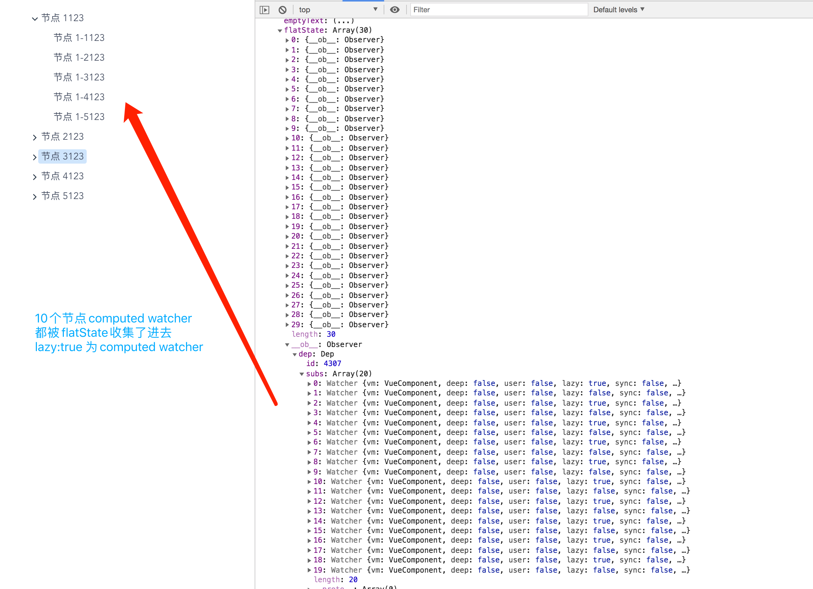

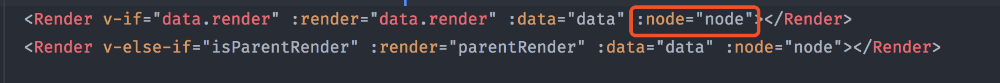

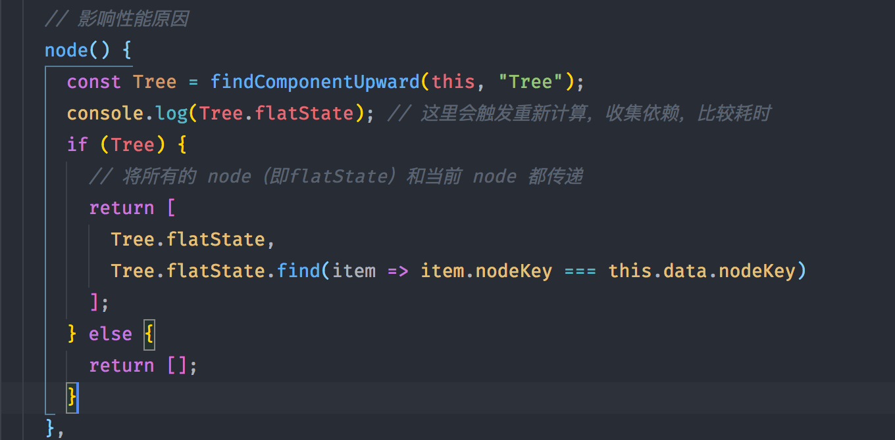

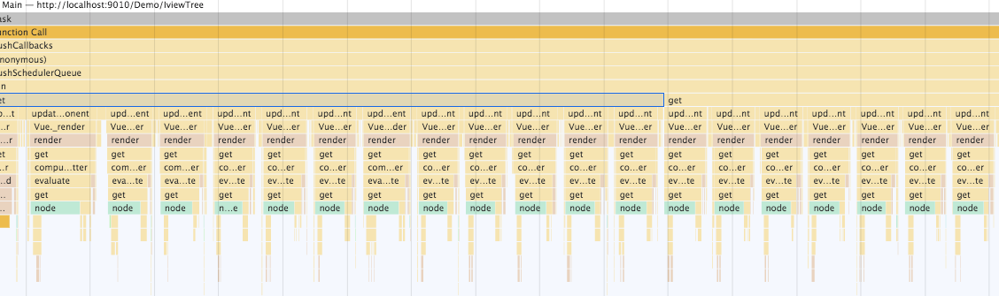


如何解决？

1、简单粗暴，去掉node计算属性，缺点是render回调中没有返回扁平后的节点依赖，所以不能做类似编辑目录树这些组件，只能是纯渲染的目录树

2、另一种方法是，render节点改成函数式组件，减少实例化开销，并且采用 provide/inject 方法，把Tree实例传递下去，然后在render函数中拿到Tree.flatState

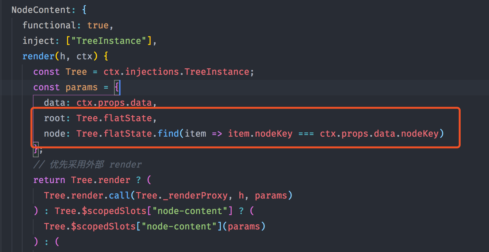

这样外部就能拿到更多的数据了，跟iview原来用法一致

这种方案，在优化前的耗时是图1，优化后的耗时是图2:

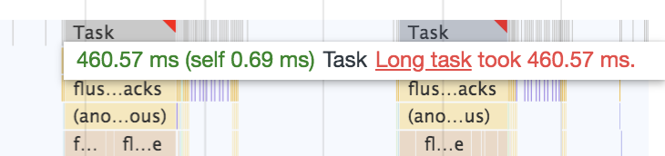

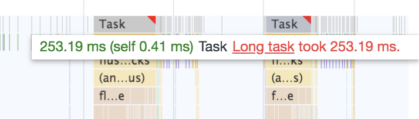

渲染快了200多ms，但是总体还是偏慢，主要是触发了Tree.flatState去收集了节点组件render watcher的依赖，但是不用再去收集上面所说的node计算属性watcher了， 如果当前渲染节点少于600个节点，速度是没问题的，如果超过，每个节点在执行render函数时都会触发getter反复去收集依赖，即使收集依赖函数是0.6ms，0.6ms * 600 = 360ms，360ms在肉眼能感受到延迟，但是总体比1.8s快多了。

5、3000+节点目录树渲染

浙江省厅项目组那边遇到了个目录树加载的问题，就是在使用iview的tree组件，大数据量(1000+节点)情况下会非常卡顿，特别是折叠的时候，他们非常着急，所以求助了我。因为之前我优化过iview的tree组件卡顿问题，所以拿出我优化过的组件测试了下，虽然提速比较明显，但是依旧卡顿，掉帧明显。后来，我拿出了自己之前用ts写的树组件轮子(开源项目)，不依赖任何第三方库，很轻量，性能还不错，因为只会递归一次，加上用了事件代理，全局也只会绑定一个点击事件和一个双击事件，而iview在折叠的时候都会进行递归，每个节点都会有多个点击事件，所以会非常卡。经过测试，我的树组件轻松渲染3000+子节点数据，折叠也非常顺滑。这次经历，说明有空还是多练习写点轮子，说不定以后在某个关键时候就用得上了，解决燃眉之急。

6、长列表渲染

TODO


### 有哪些印象深刻的点

#### 系统升级方面

1、底层升级， axios 基于业务特点进行二次封装，layout 层抽象，读取路由表渲染，权限实现，项目结构的划分

2、提供外部配置文件提高实施部署效率，运行时读取json文件 -> 写入vuex -> 实例化 axios -> new Vue()

3、写了哪些全局组件？类似百度搜索(省市县)区域选择组件、二次封装modal、iframe组件、菜单组件...

4、require.context 自动注册全局组件，还有全局组件demo预览页面，文件夹即路由

5、iconfont不支持增量更新，所以采用svg替代，写了一个svg预览页面，方面开发去预览和读取，配合自研的svg-load插件

6、自动合并代码、打tag、打版本脚本

7、推广单元测试

8、使用hjson替代json，hjson支持内部写注释，让实施明白配置文件中字段的含义

9、合理利用缓存函数缓存请求的配置文件，避免没必要的重复请求


## 算法

### 树相关

#### 深度优先遍历

```js
const data = [
  {
    title: '1',
    children: [
      {
        title: '1-1',
        children: [
          {
            title: '1-1-1',
          },
          {
            title: '1-1-2',
          },
        ],
      },
      {
        title: '1-2',
        children: [
          {
            title: '1-2-1',
          },
        ],
      },
    ],
  },
  {
    title: '2',
    children: [
      {
        title: '2-1',
      },
    ],
  },
];

// 递归版本
function deepFirstSearch1(data) {
  const list = [];

  (function _search(data) {
    Array.isArray(data) &&
      data.forEach((node) => {
        list.push(node);
        const { children } = node;
        if (children && children.length !== 0) {
          _search(children);
        }
      });
  })(data);

  return list;
}
```


#### 广度优先遍历

```js
const data = [
  {
    title: '1',
    children: [
      {
        title: '1-1',
        children: [
          {
            title: '1-1-1',
          },
          {
            title: '1-1-2',
          },
        ],
      },
      {
        title: '1-2',
        children: [
          {
            title: '1-2-1',
          },
        ],
      },
    ],
  },
  {
    title: '2',
    children: [
      {
        title: '2-1',
      },
    ],
  },
];

// 广度优先是按一层层来遍历，每层搜索完再搜索下一层
function BreadthFirst(data) {
  const list = [];
  let queue = []; // 用队列解决，先进先出

  Array.isArray(data) &&
    data.forEach((node) => {
      queue.push(node);
    });

  while (queue.length) {
    const item = queue.shift();
    list.push(item);

    const { children } = item;

    if (children && children.length) {
      queue = [...queue, ...children];
    }
  }

  return list;
}
```


### 链表


## webpack

webpack是模块打包工具，通过一个配置文件，找到入口文件，从这个入口文件开始，找到所以的依赖，构建依赖图，然后进行打包、编译、压缩、优化，最终生成一个浏览器可以直接运行的js文件。


### 构建流程

初始化参数：从配置文件和 Shell 语句中读取与合并参数,得出最终的参数。

开始编译：用上一步得到的参数初始化 Compiler 对象,加载所有配置的插，,执行对象的 run 方法开始执行编译。

确定入口：根据配置中的 entry 找出所有的入口文件。

编译模块：从入口文件出发,调用所有配置的 Loader 对模块进行翻译,再找出该模块依赖的模块，再递归本步骤直到所有入口依赖的文件都经过了本步骤的处理。

完成模块编译：在经过第 4 步使用 Loader 翻译完所有模块后，得到了每个模块被翻译后的最终内容以及它们之间的依赖关系。

输出资源：根据入口和模块之间的依赖关系，组装成一个个包含多个模块的 Chunk，再把每个 Chunk 转换成一个单独的文件加入到输出列表,这步是可以修改输出内容的最后机会。

输出完成：在确定好输出内容后，根据配置确定输出的路径和文件名,把文件内容写入到文件系统。


### `import moduleName from 'xxModule'`

import经过webpack打包以后变成一些`Map`对象，`key`为模块id，`value`为模块的可执行函数；

例如index.js文件

```js
import m1 from './m1';

m1();
```

会被打包成

```js
{
	"./src/index.js":
  
(function(module, __webpack_exports__, __webpack_require__) {

"use strict";
__webpack_require__.r(__webpack_exports__);
var _m1__WEBPACK_IMPORTED_MODULE_0__ = __webpack_require__(/*! ./m1 */ "./src/m1.js");

function init() {
  // 拿到default执行
  Object(_m1__WEBPACK_IMPORTED_MODULE_0__["default"])();
}

init();


/***/ }),
```

接下来就由`__webpack_require__`函数进行模块加载，拿到并保存模块导出的值，最后执行


### 异步模块打包执行流程

当一个文件被异步加载，在`index.js`中这么写

```js
import(/*webpackChunkName: "async"*/'./async').then((res) => {
  res.default();
});
```

被webpack处理过后index.js的样子，剔除引导模板runtime

```js
(window["webpackJsonp"] = window["webpackJsonp"] || []).push([["app"],{

/***/ "./src/index.js":
/*!**********************!*\
  !*** ./src/index.js ***!
  \**********************/
/*! no static exports found */
/***/ (function(module, exports, __webpack_require__) {

__webpack_require__.e(/*! import() | async */ "async")
  // 需要被__webpack_require__加载
  // __webpack_require__ 返回 module.exports
  .then(__webpack_require__.bind(null, /*! ./async */ "./src/async.js"))
  .then((res) => {
  	res.default();
	});


/***/ })

},[["./src/index.js","runtime"]]]);
```

出现2个关键字，一个`webpackJsonp`，一个`__webpack_require__.e`

`webpackJson.push`其实已经被重写了，并不是`Array.prototype.push`，而是一个函数，叫`webpackJsonpCallback`，为什么叫`jsonpCallbak`?其实很好理解，异步的chunk是通过script标签加载的，跟jsonp原理一样。当异步chunk下载完后，首先就是执行这个`webpackJsonpCallback`函数，看看这个函数

```js
/******/ 	function webpackJsonpCallback(data) {
            // 异步加载的文件中存放的需要安装的模块对应的 Chunk ID
/******/ 		var chunkIds = data[0];
            // 异步加载的文件中存放的需要安装的模块列表
/******/ 		var moreModules = data[1];
            // 在异步加载的文件中存放的需要安装的模块都安装成功后，需要执行的模块对应的 index
  					// 比如 app.js 就是需要最开始执行的
/******/ 		var executeModules = data[2];
/******/
/******/ 		// add "moreModules" to the modules object,
/******/ 		// then flag all "chunkIds" as loaded and fire callback
/******/ 		var moduleId, chunkId, i = 0, resolves = [];
/******/ 		for(;i < chunkIds.length; i++) {
/******/ 			chunkId = chunkIds[i];
/******/ 			if(Object.prototype.hasOwnProperty.call(installedChunks, chunkId) && installedChunks[chunkId]) {
  							// installedChunks[chunkId][0] 就是 promise resolve 函数
/******/ 				resolves.push(installedChunks[chunkId][0]);
/******/ 			}
              // 标记该chunk已经加载完成，0即完成
/******/ 			installedChunks[chunkId] = 0;
/******/ 		}
            // 把所有的模块加入 modules 的对象中, 就是 __webpack_require__.m 对应的那个属性
/******/ 		for(moduleId in moreModules) {
/******/ 			if(Object.prototype.hasOwnProperty.call(moreModules, moduleId)) {
/******/ 				modules[moduleId] = moreModules[moduleId];
/******/ 			}
/******/ 		}
/******/ 		if(parentJsonpFunction) parentJsonpFunction(data);
/******/    
/******/ 		while(resolves.length) {
/******/ 			resolves.shift()();
/******/ 		}
/******/
/******/ 		// add entry modules from loaded chunk to deferred list
/******/ 		deferredModules.push.apply(deferredModules, executeModules || []);
/******/
/******/ 		// run deferred modules when all chunks ready
  					// 这个函数也很重要，主要是就是执行入口文件，比如app.js
/******/ 		return checkDeferredModules();
/******/ 	};
```

这个函数，接受一个数组参数，包括chunkid，moreModules模块列表，executeModules需要先执行的模块

具体作用

1、是用来标识该chunk加载完成，因为只有下载完才会执行这个callback函数

2、把moreModules，也就是把第二个参数模块Map对象放到runtime最外层作用域的modules数组中，不然`__webpack_require__`拿不到模块

3、resolve`__webpack_require__.e`函数加载chunk返回的promise，通知`__webpack_require__`函数加载和执行模块

4、链式调用promise，把module当参数，执行用户定义的then回调

5、带有入口文件的话，就先执行入口文件

`__webpack_require__.e`简化代码，分析如下

```js
// 记录chunk状态
// key: id, value: 状态
// undefined: 未加载
// 数组: 加载中
// 0：已加载
var installedChunks = {
  
}

__webpack.require__.e = function requireEnsure(chunkId) {
  var promises = []
  
  if (installedChunks[chunkId] !== 0) {
    var promise = new new Promise(function(resolve, reject) {
	 		installedChunks[chunkId] = [resolve, reject];
 		});
    
    promises.push(promise);
  
  	var script = document.createElement('script');
  	script.charset = 'utf-8';
  	script.timeout = 120;// 120s 过后就中断
  
  	script.src = jsonpScriptSrc(chunkId); // src加载
  
  	onScriptComplete = function (event) {
    	clearTimeout(timeout);
  	}
  
  	var timeout = setTimeout(function(){
			console.error('timeout');
		}, 120000);
    
    script.onerror = script.onload = onScriptComplete;
    document.head.appendChild(script);
  }
    
  	return Promise.all(promises);
}
```

可以看到，这个函数主要作用是加载chunk，还有个chunk添加loading状态

这边还漏了个地方没讲，就是打包后的`async.js`文件分析，以及加载`async.js`过程

`async.js`文件

```js
function asyncModule() {
  console.log('async module');
}

export default asyncModule;
```

打包之后

```js
(window["webpackJsonp"] = window["webpackJsonp"] || []).push([["async"],{

/***/ "./src/async.js":
/*!**********************!*\
  !*** ./src/async.js ***!
  \**********************/
/*! exports provided: default */
/***/ (function(module, __webpack_exports__, __webpack_require__) {

"use strict";
__webpack_require__.r(__webpack_exports__);
function asyncModule() {
  console.log('async module');
}

/* harmony default export */ __webpack_exports__["default"] = (asyncModule);

/***/ })

}]);
```

可以看到，webpack也是把`async.js`函数包装了一层，先用`webpackJsonpCallback`函数标识该chunk加载完成，再把`async.js`内容放到模块数组中，然后在`index.js`的打包文件中加载再执行

执行`async.js`里的`asyncModule`函数是在`index.js`文件里面的，往上看打包后的`index.js`文件，有个逻辑，也就是then回调里面的

```js
__webpack_require__.bind(null, /*! ./async */ "./src/async.js")
```

其中，`async.js`模块内容是用`__webpack_require__`同步加载执行的，`__webpack_require__`函数是webpack加载模块的核心，先来看看这个函数源码

```js
function __webpack_require__(moduleId) {
	// Check if module is in cache
	if(installedModules[moduleId]) {
		return installedModules[moduleId].exports;
	}
	// Create a new module (and put it into the cache)
	var module = installedModules[moduleId] = {
		i: moduleId,
		l: false,
		exports: {}
	};

	// Execute the module function
  // 执行模块的函数体，也就是async打包后的包装函数
 	// modules就是存放所有webpack模块的地方
	modules[moduleId].call(module.exports, module, module.exports, __webpack_require__);
	// Flag the module as loaded
	module.l = true;
	// Return the exports of the module
	return module.exports;
}
```

加载的原理也很简单了，就是一行代码，从`modules`里面取模块加载

```js
modules[moduleId].call(module.exports, module, module.exports, __webpack_require__);
```

对应着`async.js`包装函数

```js
(function(module, __webpack_exports__, __webpack_require__) {}
```

所以，在异步模块加载之前，一定要把模块放到`modules`变量里面，然后在用`__webpack_require__`执行即可

附上流程图

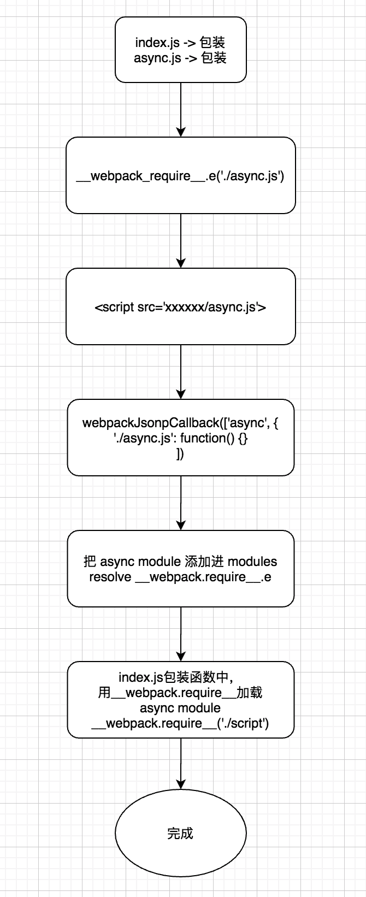


所有，完全可以让异步chunk在浏览器空闲的时候下载，因为这些chunk下载不需要先后固定顺序，可以用prefetch对某些异步路由进行提前下载，提供加载速度。

看完源码不得不惊叹，这些加载过程不需要很多代码，就能把chunk之前完全解耦开，闭包玩得太妙了。


### webpack模块在运行时是怎么存的？

每个模块都存在webpack函数中的`modules`数组变量里面，比如一个id为1的模块

```js
const modules = [];

modules[1] = {
  i: 1, // 模块id
	l: false, // 是否已经加载
	exports: {} // 导出的值
}
```

其中，通过一个表来进行存储，键为模块id，值为一个对象，里面包含了模块属性。


### module、chunk、bundle、moduleId、chunkId的区别

module：一个文件就是一个模块，无论是esm还是commonjs，都是module

chunk：把module源文件传到webpack进行打包时，webpack会根据文件引用关系生成chunk文件，不同的entry配置会生成不同的chunk的id，在webpack处理时的文件都可以称为chunk，每个chunk可以含有一个或多个module，包括懒加载的代码也可以叫chunk，打包后的代码叫chunk也可以

bundle：可以理解为浏览器可以直接运行的文件

moduleId：就是每个模块的id，可以是路径、数字或者hash值，模块加载器通过这些id进行加载

chunkId：就是打包出来的js文件的id，比如`app.xxx.js`，这个文件的chunkId就是app


### 持久化缓存方案

js、css文件不能使用hash，图片、字体、svg文件可以使用hash

css使用contentHash，使用chunkHash会使得跟其有css文件关联的js文件hash值都改变

js现在也可以使用contentHash了，但是有些旧版本webpack是不支持的

如果js用chunkHash的话，采用以下方案

1、需要用HashedModuleIdsPlugin固定住moduleId(如果不使用，webpack则会使用自增的id，当增加或者删除module的时候，id就会发生变化，没有改过的文件的id也变了，缓存失效)，HashedModuleIdsPlugin是把路径hash化当成模块id

2、使用NamedChunkPlugin+魔法注释来固定住chunkId

到了webpack5.0，moduleId和chunkId问题都可以不用插件解决，直接使用

```js
module.exports = {
 optimization:{
  chunkIds: "deterministic”, // 在不同的编译中不变的短数字 id
	moduleIds: "deterministic"
 }
}
```

还有一个很重要，但是vuecli却没内置的方案，也就是要把引导模板给提取出来

为什么要提取？这边简单说下

比如在vuecli创建的工程项目中，有一个懒加载路由`About.vue`，打包出来会有`app.contenthash.js`和`about.contenthash.js`，如果我修改了`About.vue`内容，打包出来的`about.contenthash.js`文件hash必然会变，但是你会发现，`app.contentHash.js`也跟着变了，如果在大型项目中这样搞，改了一个路由页面，导致`app.js`也变，这样就使得`app.js`缓存失效了，这文件还不小。

为什么`app.js`会变，怎么解决？

这里有个引导模板的概念，也就是webpack加载bundle的一些前置函数，例如webpackJsonpCallback、webpack-require、还是script src加载这些，这些函数是不会变的，但是里面的chunk文件映射关系会变，所谓的映射关系，可以看这个函数

```js
function jsonpScriptSrc(chunkId) {
	return __webpack_require__.p + "" + ({}[chunkId]||chunkId) + "." + {"about":"c19c62a2"}[chunkId] + ".js"
}
```

可以看到，chunk文件id和hash值的映射都在这个函数里面，比如一个chunk叫`about.c19c62a2.js`，在引导模板中就为`{ about: "c5988801" }`，所以每个chunk文件的id变动都会改变这个映射关系，`About.vue`的id变了，当然这个引导模板文件也会变，引导模板又默认放到`app.js`里面，所以需要把这个引导模板抽取出来，独立加载，不要影响`app.js`的hash值

解决方法，webpack添加以下配置

```js
{
 	optimization: {
   runtimeChunk: 'single' // true 也可以，不过每个entry chunk就有一个runtime
  }
}
```

这样就可以把runtimeChunk打包出来，`app.js`不会因为`about.js`变化而改变

但是还有个问题，这个chunk很小，没必要消耗一次http请求，不然请求时间会大于加载时间，所以直接内联到html模板里面就可以了

可以用`script-ext-html-webpack-plugin`插件实现

```js
const ScriptExtHtmlWebpackPlugin = require('script-ext-html-webpack-plugin');

module.exports = {
  productionSourceMap: false,
  configureWebpack: {
    optimization: {
      runtimeChunk: 'single'
    },
    plugins: [
      new ScriptExtHtmlWebpackPlugin({
        inline: /runtime.+\.js$/
      })
    ]
  },
  chainWebpack: config => {
    config.plugin('preload')
      .tap(args => {
        args[0].fileBlacklist.push(/runtime.+\.js$/)
        return args
      })
  }
};
```


### 热替换原理

简单来说就是：

hot-module-replacement-plugin 包给 webpack-dev-server 提供了热更新的能力，它们两者是结合使用的，单独写两个包也是出于功能的解耦来考虑的。
1、webpack-dev-server提供 bundle server的能力，会启动一个服务器，创建websocket链接，把浏览器创建socket链接逻辑塞进打包后的bundle.js里面

2、webpack监听文件变化，重新编译，利用 socket 告诉 devServer/client 新模块的hash值

3、hot-module-replacement-plugin 提供 HMR 的 runtime，并且将 runtime 注入到 bundle.js 代码里面去

4、HMR.runtime 根据服务器提供的最新hash值，调用`hotDownloadManifest`发起模块更新列表json的请求，调用`hotDownloadUpdateChunk`发送`hash.hot-update.js` 请求，也就是最新模块代码

5、执行hash.hot-update.js，调用`webpackHotUpdate`函数

6、`webpackHotUpdate`核心作用，就是删除过期模块，将新模块添加到modules中，`__webpack_require__`函数执行模块代码，完成模块替换

7、最后调用`module.hot.accept()`完成具体逻辑，比如vue和react的热更新都是通过这个api进行组件更新替换


### filename和chunkFilename的区别

filename即为打包出来的文件名，比如

```js
{
  entry: {
    index: './src/index.js'
  },
  output: {
    filename: '[name].min.js'
  }
}
```

打包出来的即为`index.min.js`

chunkFilename一般为懒加载的代码块

```js
import('src/xxx').then(module => {});
```

打包出来的有可能就是`0.min.js`，默认使用`[id].js`，或者读取`filename`值，替换`[name]`，即为`[id].min.js`

当然可以使用webpack魔法注释

```js
import(/* webpackChunkName: "xxx" */'src/xxx')
```

出来的文件就是`xxx.js`


### loader和plugin的开发

loader负责模块的转义工作，要遵循单一原则，每个loader拿到源文件内容，处理完成并返回给webpack，就是一个处理函数，具体开发参考官方文档

plugin通常来说是个class类，里面拓展了webpack的一些功能，webpack在运行时会广播出许多事件，在plugin中订阅这些事件，在合适的时机通过webpack提供的api改变输出的结果


### 项目优化

- 开发环境剔除第三方包，用cdn加载
- thread-loader多线程构建优化，通过SMP分析打包过程中loader和plugin的耗时
- 缩小打包作用域：尽可能使用alias、exclude/include确定loader规则范围
- 合理配置chunk缓存化


## 正则

正则表达式的() [] {}有不同的意思。

() 是为了提取匹配的字符串。表达式中有几个()就有几个相应的匹配字符串。

(\s*)表示连续空格的字符串。

[]是定义匹配的字符范围。比如 [a-zA-Z0-9] 表示相应位置的字符要匹配英文字符和数字。[\s*]表示空格或者*号。

{}一般用来表示匹配的长度，比如 \s{3} 表示匹配三个空格，\s{1,3}表示匹配一到三个空格。

(0-9) 匹配 '0-9′ 本身。 [0-9]* 匹配数字（注意后面有 *，可以为空）[0-9]+ 匹配数字（注意后面有 +，不可以为空）{1-9} 写法错误。

[0-9]{0,9} 表示长度为 0 到 9 的数字字符串。


## 浏览器

### 浏览器渲染

1. 静态资源并不是同时请求的，也不是解析到指定标签的时候才去请求的，浏览器会自行判断；
2. JS 会阻塞页面的解析和渲染，同时浏览器也存在预解析，遇到阻塞可以继续解析下面的元素；
3. CSS 不阻塞dom树的构建解析，只会阻塞其后面元素的渲染，不会阻塞其前面元素的渲染；
4. 图片既不阻塞解析，也不阻塞渲染。


### 什么情况阻塞页面渲染

浏览器在解析`script`标签，会暂停dom的构建，所以script标签要放到body标签底部

js下载和执行都会阻塞页面的渲染，DOM 树解析到非异步的外联 js 时会阻塞住，在它加载并且执行完之前，不会往下解析 DOM 树

当`script`有`defer`或者`async`标签时，则会异步下载

defer：异步并行下载，不影响dom的解析，dom解析完后，在`DOMContentLoaded`事件响应前按顺序执行，有 `defer` 属性的脚本会阻止 `DOMContentLoaded` 事件，直到脚本被加载并且解析完成。

async：同样是并行下载，不会影响dom的解析，不同的是，脚本下载完后就直接执行了，而且是无序执行，跟`DOMContentLoaded`事件无关，比较适合加载无dom操作的脚本代码。

如果`script`标签同时添加`async`和`defer`，浏览器优先执行`async`，不支持则执行`defer`


### 重绘和回流

重绘是当节点需要更改外观而不影响布局，改变color就为重绘

回流是布局或者几何属性需要改变

回流必定发生重绘


#### 如何避免触发回流和重绘

CSS：

- 避免使用table布局。
- 尽可能在DOM树的最末端改变class。
- 避免设置多层内联样式。
- 将动画效果应用到`position`属性为`absolute`或`fixed`的元素上
- 避免使用CSS表达式（例如：`calc()`）
- CSS3硬件加速（GPU加速）

JavaScript：

- 避免频繁操作样式，最好一次性重写style属性，或者将样式列表定义为class并一次性更改class属性
- 避免频繁操作DOM，创建一个`documentFragment`，在它上面应用所有DOM操作，最后再把它添加到文档中
- 也可以先为元素设置`display: none`，操作结束后再把它显示出来。因为在display属性为none的元素上进行的DOM操作不会引发回流和重绘
- 避免频繁读取会引发回流/重绘的属性，如果确实需要多次使用，就用一个变量缓存起来
- 对具有复杂动画的元素使用绝对定位，使它脱离文档流，否则会引起父元素及后续元素频繁回流


### 输入URL到页面展示

1、浏览器从地址栏的输入中进行DNS查询，获得服务器的 IP 地址和端口号

2、浏览器用 TCP 的三次握手与服务器建立连接

3、浏览器向服务器发送HTTP请求

4、服务器收到报文后处理请求，同样拼好报文再发给浏览器

5、浏览器解析报文，渲染输出页面

渲染过程  **DOM -> CSSOM -> render -> layout -> print**

1、根据HTML结构生成DOM树

2、根据CSS生成CSSOM

3、将DOM和CSSOM整合形成RenderTree

4、根据RenderTree开始渲染

5、遇到`script`标签，会执行并阻塞渲染


### 跨域

浏览器出于安全考虑，有同源策略，也就是协议+域名+端口号要相同。

1、jsonp

用`script`加载get请求地址，把回调函数名告诉后端，让后端返回`callback(data)`，这样就可以执行这个回调函数了，不过这个函数名是全局变量的

2、CORS

服务端设置 `Access-Control-Allow-Origin` 就可以开启 CORS

3、postMessage


## 性能优化

- 减少DOM的访问次数，可以将DOM缓存到变量中；
- 减少**重绘**和**回流**，任何会导致**重绘**和**回流**的操作都应减少执行，可将**多次操作合并为一次**；
- 尽量采用**事件委托**的方式进行事件绑定，避免大量绑定导致内存占用过多；
- css层级尽量**扁平化**，避免过多的层级嵌套，尽量使用**特定的选择器**来区分；
- 动画尽量使用CSS3**动画属性**来实现，开启GPU硬件加速；
- 图片在加载前提前**指定宽高**或者**脱离文档流**，可避免加载后的重新计算导致的页面回流；
- css文件在`<head>`标签中引入，js文件在`<body>`标签中引入，优化**关键渲染路径**；
- 加速或者减少HTTP请求，使用**CDN加载静态资源**，合理使用浏览器**强缓存**和**协商缓存**，小图片可以使用**Base64**来代替，合理使用浏览器的**预取指令prefetch**和**预加载指令preload**；
- 压缩混淆代码**，**删除无用代码**，**代码拆分**来减少文件体积；**
- 小图片使用雪碧图**，图片选择合适的**质量**、**尺寸**和**格式**，避免流量浪费。
- 减少关键资源的个数和大小（`Webpack`拆/合包，懒加载等）
- 图片懒加载


## 项目代码、样式规范管理

- 跟UI对接，开发相应的全局组件，在业务模块中统一使用，不得重复造轮子
- 全局scss变量、scss函数管理样式
- eslint、prettier、precommit
- 任何人如果修改了全局scss变量、scss函数，都需要在文档上声明
- 制定编码规范，命名规范，并提供相关文档
- 统一vscode插件，统一vscode插件配置json
- 定期code review，记录不合理地方和表扬优雅的代码
- 提供项目基线版本，项目目录结构一致

### Code Review

- 命名混乱
- div节点冗余
- css冗余
- 过多的if else
- 全局组件带有子模块业务代码
- 注释太少，data变量注释要带上

## 工程架构能力

### 脚手架

开发了一款公司内部使用的脚手架

1、创建项目

2、快速启动cz-customizable

3、初始化开发环境

4、执行脚本

5、版本升级


### 框架搭建

搭建项目基础框架

1、符合规范的组织结构

2、提供常用工具的配置 prettier、eslint、husky

3、集成内部组件库

4、配置文件读取写入

5、自动加载全局组件&vuex modules

6、eventBus 解决方案

7、svg 图标

8、hjson

10、ie 11

11、bable 可选链

12、gzip

13、dart-sass

14、jest


### 微前端系统设计

初衷

1、子系统增量更新

2、子系统可独立部署

3、子系统交给不同团队开发

4、不用iframe

考虑点

1、single-spa，systemjs 接入

2、api设计，命名？兼容旧版本都需要考虑

3、设计系统初始化的整个链路，各个模块间的联系(在子系统加载前要拿到一些信息)

#### 状态管理

主应用和子应用如何共享状态？

自研了一个状态管理器，叫mircoStore，类似vuex的使用方式，存储全局状态

#### 样式管理

为了避免样式冲突，每个子应用都有一个css命名空间，就是id，在singeSpaVue的选项中传入，在调用的时候添加上

#### 注册应用

模块注册使用systemjs，因为模块加载是用了systemjs

single-spa注册应用，在回调函数中让systemjs加载子应用

#### 全局组件复用

全局组件统一在main-app上注册，也是主应用

一定要加载完主应用再去加载子应用

#### 抽离共同依赖

webpack externals 依赖，比如vue这些

这些都是用script标签进行加载，所以这些都是全局的

还有一些工具库也是通过这种方式加载，用rollup打包成umd方式

#### 权限控制

权限控制是主要是采用动态addRoutes的方式，跟单体应用略有不同

在main-app加载之前，也就是在single-spa生命周期bootstrap中，进行资源加载

资源包括了地图资源、路由资源这些，获取到这些资源之后，都放到microStore中

在子应用的挂载前，同样也是bootstrap中，读取对应子应用的路由权限，动态addRoutes

